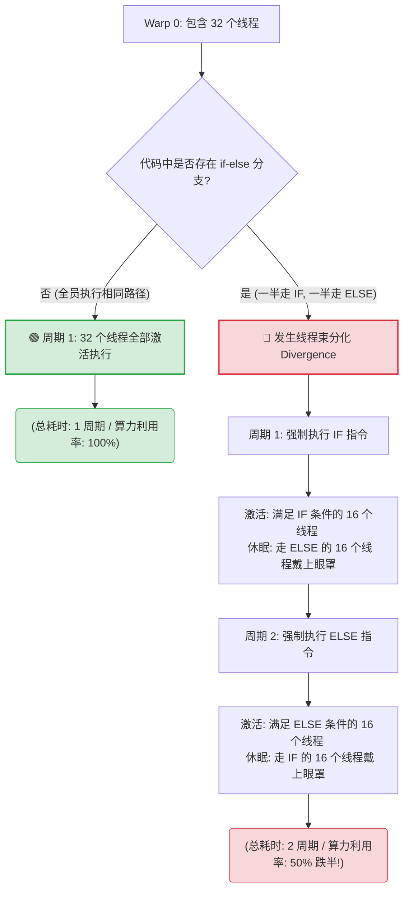
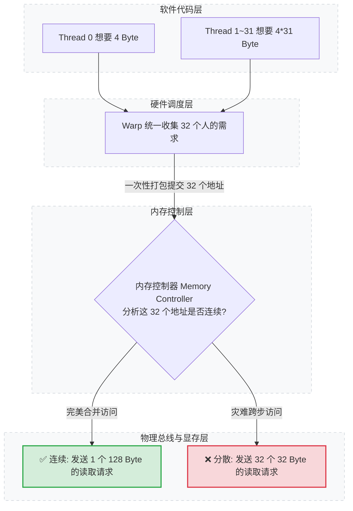
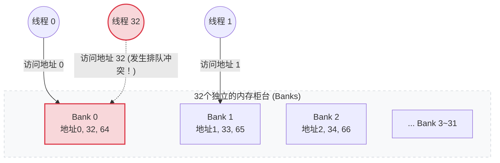

# GPU 基础：显卡驱动与 CUDA Toolkit 的关系

在开始 CUDA 编程前，需要先了解一下显卡驱动（GPU Driver）和 CUDA Toolkit（开发工具包）之间的关系。

## 一、 核心分工、组件与架构数据流

### 1.1 核心分工与角色定位

在 CUDA 编程环境中，NVIDIA GPU 驱动和 CUDA Toolkit 扮演着截然不同但紧密协作的角色。

|**组件官方名称**|**扮演的角色**|**包含的核心内容**|**作用机制**|
|---|---|---|---|
|**GPU 驱动**<br><br>  <br><br>(NVIDIA Driver)|硬件的接口与代言人|底层硬件接口、CUDA 驱动 API<br><br>  <br><br>(`libcuda.so` / `nvcuda.dll`)|让操作系统和应用能控制显卡。接收上层指令，直接操控物理显卡执行计算。|
|**CUDA Toolkit**<br><br>  <br><br>(CUDA Toolkit)|开发者的武器库<br><br>  <br><br>(软件工具包)|编译器 (`nvcc`)、数学库 (`cuBLAS`/`cuFFT`)、CUDA 运行时 API (`libcudart`)|用于编写和编译 CUDA 代码。将高级 C/cpp 代码编译为机器码，并提供运行时库。|

### 1.2 CUDA Toolkit 包含的组件清单

为了让你写代码、做优化，CUDA Toolkit 内部集成了以下核心武器：

|**📦 组件**|**📝 作用**|
|---|---|
|**nvcc**|CUDA C/cpp 编译器|
|**cuBLAS**|线性代数运算库|
|**cuDNN**|深度学习原语库（需单独下载）|
|**cuFFT**|快速傅里叶变换库|
|**cuRAND**|随机数生成库|
|**Nsight Systems**|系统级性能分析工具|
|**Nsight Compute**|Kernel 级性能分析工具|
|**CUDA Runtime** (`libcudart`)|运行时 API 库|
|**cuda-gdb**|GPU 调试器|

### 1.3 架构与数据流向

当你运行一个 CUDA 程序时，代码、Toolkit 和驱动之间的协作逻辑如下：

代码段

```
graph TD
    A[你的 CUDA 源码 *.cu] -->|使用 nvcc 编译| B[可执行二进制程序]
    B -->|调用高级控制接口| C[CUDA Runtime API <br> libcudart.so / cudart.dll]
    C -->|向下传递请求| D[CUDA Driver API <br> libcuda.so / nvcuda.dll]
    D -->|直接操控硬件| E[物理 GPU 显卡]

    style A fill:#f9f,stroke:#333,stroke-width:2px
    style B fill:#bbf,stroke:#333,stroke-width:2px
    style C fill:#bfb,stroke:#333,stroke-width:2px
    style D fill:#fbb,stroke:#333,stroke-width:2px
    style E fill:#fff,stroke:#333,stroke-width:2px
```

> [!important] **核心总结**
> 
> **驱动**相当于是硬件设备的底层接口，便于系统或用户操作硬件；而 **Toolkit** 是英伟达开发的一款软件工具包，用于将 CUDA 代码编译为机器可以理解的程序，并提供运行时的库（Runtime），这些库最终通过驱动去调用显卡完成计算。

## 二、 避坑核心：版本兼容性与“两个 CUDA 版本”

这是 CUDA 环境配置中最容易让人混淆的地方。在电脑中，经常会看到两个不同的 CUDA 版本：

### 2.1 驱动版本 (Driver Version) 与 nvidia-smi

- **查看命令**：`nvidia-smi`
    
- **代表含义**：当前显卡驱动所能支持的 **最高 CUDA Toolkit 版本**。
    
- **兼容原则**：**向后兼容**。驱动版本越高越好，新驱动可以运行用旧版 Toolkit 编译的程序。如果 Toolkit 版本高于驱动支持的版本，程序会报错（如 `driver version is insufficient`）。
    

### 2.2 编译器版本 (Compiler Version) 与 nvcc

- **查看命令**：`nvcc --version`
    
- **代表含义**：你当前实际安装并正在使用的 **CUDA Toolkit（开发工具包）版本**。
    

> [!tip] **避坑金律**
> 
> 只要保证 $\text{nvcc --version (Toolkit版本)} \le \text{nvidia-smi (驱动支持的最高版本)}$，你的 CUDA 程序就能完美运行！

## 三、 实战监控：剖析 nvidia-smi 面板信息

执行 `nvidia-smi` 命令后，你会看到一个终端面板。我们将这个面板拆解为【头部信息】、【GPU 状态矩阵】和【进程监控】三个部分。

![[Pasted image 20260520210105.png]]

### 3.1 头部信息（环境版本诊断）

面板第一行是环境配置的关键，决定了你的代码能不能跑通：

- **NVIDIA-SMI 525.60.13**：当前 nvidia-smi 工具的版本（通常与驱动版本一致）。
    
- **Driver Version: 525.60.13**：你当前安装的物理显卡驱动版本。
    
- **CUDA Version: 12.0**：**【重点】** 驱动支持的最高 CUDA Toolkit 版本（Runtime 版本）。你实际安装的 Toolkit 版本（`nvcc -V`）不能高于这个数字。
    

### 3.2 GPU 状态矩阵（硬件实时监控）

中间的核心表格展示了显卡的健康状况和负载。我们按上下对应的区块来解读：

#### 左侧：基本物理状态

- **GPU (0)**：显卡的编号。如果插了多张卡，会从 0, 1, 2... 排列。
    
- **Name (NVIDIA GeForce RTX 4090)**：显卡的具体型号。
    
- **Fan (30%)**：风扇转速百分比。0% 代表风扇没转（或低载停转），100% 代表全力输出。
    
- **Temp (45C)**：显卡核心当前温度（摄氏度）。跑深度学习大模型时要特别注意别超过 80°C ~ 85°C，过高会触发降频保护。
    
- **Perf (P0)**：性能状态（Performance State）。从 P0 到 P12，P0 代表最高性能，P12 代表最省电/休眠状态。
    

#### 中间：通信与功耗

- **Persistence-M (Off)**：持续模式是否开启。如果设为 On，GPU 驱动会常驻内存，程序启动响应更快，但会稍微多消耗一点待机功耗。
    
- **Bus-Id (00000000:01:00.0)**：显卡插在主板上的 PCIe 总线编号（开发多卡并行程序指定 GPU 时可能会用到）。
    
- **Disp.A (On)**：Display Active，代表这张显卡当前是否连接了显示器并用于画面输出。
    
- **Pwr: Usage / Cap (55W / 450W)**：
    
    - `55W`：当前 GPU 的实时功耗。
        
    - `450W`：该显卡的功耗上限（TDP）。如果 Usage 顶着 Cap 跑，说明显卡在满载全力计算。
        

#### 右侧：显存与算力

- **Volatile Uncorr. ECC (Off)**：错误检查和纠正（ECC）内存是否开启。消费级显卡（RTX 4090/3090等）通常不支持（显示 Off/NA），企业级计算卡（A100/H100）会开启，防止跑大模型时发生数据位翻转。
    
- **Memory-Usage (1200MiB / 24564MiB)**：**【核心指标】**
    
    - `1200MiB`：当前已经被占用的显存。
        
    - `24564MiB`：这张卡的显存总容量（约 24GB）。
        
- **GPU-Util (15%)**：GPU 算力利用率。代表在过去的一秒内，GPU 里的计算核心（CUDA Core）有多少比例的时间在忙着干活。_注：有时候显存满了（Memory-Usage 很高），但 GPU-Util 是 0%，说明数据死锁或者 CPU 传数据太慢，GPU 在闲着“等米下锅”。_
    
- **Compute M. (Default)**：计算模式。Default 代表允许多个进程同时使用这张显卡。
    

> [!warning] **初学者必看错误**
> 
> 如果正在运行程序时，左边的数字快要等于右边的数字，就会爆出大名鼎鼎的 `CUDA out of memory (OOM)` 错误。

### 3.3 Processes 进程监控（谁在吃你的显存？）

面板最下方的 Processes 列表非常像任务管理器，展示了当前是哪些程序在压榨你的 GPU：

- **GPU**：该进程占用了哪张显卡（对应上面的 GPU 编号）。
    
- **PID (1234)**：进程 ID（Process ID）。
    
- **Type**：进程类型。
    
    - `G (Graphics)`：图形渲染进程（比如操作系统桌面、游戏、浏览器）。
        
    - `C (Compute)`：CUDA 计算进程（你的 python 深度学习脚本、cpp CUDA 程序都会显示为 C）。
        
    - `C+G`：同时进行计算和渲染。
        
- **Process name (python3)**：正在运行的程序名字。
    
- **GPU Memory Usage (1180MiB)**：这个特定进程独自吃掉了多少显存。
    

> [!tip] **极速清理显存小技巧**
> 
> 如果你的程序死机了，或者你发现显存被莫名其妙的进程占满了，可以根据面板里的 PID，在终端执行以下命令直接强行杀掉该进程，释放显存：
> 
> - **Linux**: `kill -9 1234` (1234 换成实际的 PID)
>     
> - **Windows (CMD)**: `taskkill /F /PID 1234`
>     

## 四、 Toolkit 与 驱动的版本匹配规则

NVIDIA 官方对两者的版本兼容性有一套严格的硬件与软件工程标准，主要分为 **大版本隔离** 和 **小版本兼容**。

### 4.1 核心匹配矩阵（各大版本最低驱动要求）

每一个 CUDA Toolkit 大版本，都要求系统驱动版本必须大于或等于一个特定的基线：

|**CUDA Toolkit 版本**|**Linux 最低驱动版本要求**|**Windows 最低驱动版本要求**|**典型支持的 GPU 架构**|
|---|---|---|---|
|CUDA 13.x|$\ge 580.xx$|$\ge 581.xx$|Blackwell 等最新架构|
|CUDA 12.x|$\ge 525.60$|$\ge 527.41$|Hopper, Ada Lovelace, Ampere|
|CUDA 11.x|$\ge 450.80$|$\ge 452.39$|Ampere, Turing, Volta|
|CUDA 10.x|$\ge 410.48$|$\ge 411.31$|Pascal, Maxwell|

### 4.2 必须遵守的两大版本定律

NVIDIA 从 CUDA 11.0 开始放宽了限制，引入了“小版本兼容性（Minor Version Compatibility）”，具体规则如下：

#### 1. 强力向后兼容 (Driver Backwards Compatibility)

- **规则**：新驱动 + 旧 Toolkit = 完美运行。
    
- **解释**：如果你的显卡驱动更新到了最新的 580.xx（支持 CUDA 13），你电脑里不管是装了 CUDA 12.8、12.1 还是 CUDA 11.8，它们全都能直接跑，完全不需要降级驱动。
    

#### 2. 同大版本内小版本兼容 (Minor Version Compatibility)

- **规则**：旧驱动 + 同大版本新 Toolkit = 可以运行。
    
- **解释**：在 CUDA 12 这一代里，如果你的驱动是比较旧的 525.60（刚出 CUDA 12.0 时的驱动），你依然可以直接使用 CUDA 12.8 Toolkit 来编译和运行程序。因为只要驱动满足该大版本的最低基线（即 $\ge 525.60$），整个 12.x 系列的 Toolkit 都能兼容。
    

> [!danger] **跨大版本的绝对红线**
> 
> **不能用旧驱动去跑跨大版本的新 Toolkit！**
> 
> _例如：驱动是 450.80（属于 CUDA 11 世代），此时如果你安装并使用 CUDA 12.x 或 13.x Toolkit，程序在初始化时会 100% 崩溃，报 `CUDA_ERROR_SYSTEM_DRIVER_MISMATCH`（驱动版本不足）错误。_

### 4.3 生产环境避坑建议

- **能升驱动就升驱动**：把 NVIDIA 显卡驱动升级到你当前显卡能支持的最新版，这样你的系统就能向下兼容几乎所有的 CUDA Toolkit 版本。
    
- **看好深度学习框架的需求**：如果你是为了跑 PyTorch 或 TensorFlow，优先去它们官网看它们推荐哪个 CUDA 版本（例如主流的 CUDA 12.x），然后确保你的显卡驱动大于上表中的最低要求即可。
    

## 五、 NVIDIA 驱动和 Toolkit 的安装

### 5.1 NVIDIA 驱动安装

#### 方法 1：使用 apt 包管理器（推荐）

bash

```
sudo apt update
sudo apt install nvidia-driver-560

# 安装完成后重启
sudo reboot

# 验证安装
nvidia-smi
```

> [!warning] **Linux 驱动安装的隐蔽暗礁：显卡型号与驱动版本的匹配**
> 
> 在执行 `sudo apt install nvidia-driver-560` 前，强烈建议先运行一次 `ubuntu-drivers devices`。
> 
> - 如果输出里推荐的版本确实是 560（或者有 `nvidia-driver-560 - distro non-free recommended`），那就闭眼放心装。
>     
> - 如果你的显卡型号比较老（比如好几年前的旧卡），盲目装 560 可能会导致硬件不支持，此时应该改成系统推荐的那个数字。
>     

##### ubuntu-drivers device 命令输出示例解析

Plaintext

```
== /sys/devices/pci0000:00/0000:00:01.0/0000:01:00.0 ==
vendor   : NVIDIA Corporation
model    : AD102 [GeForce RTX 4090]
driver   : nvidia-driver-535 - distro non-free
driver   : nvidia-driver-550 - distro non-free
driver   : nvidia-driver-560 - distro non-free recommended
driver   : xserver-xorg-video-nouveau - distro free builtin
```

- **vendor / model**：系统底层检测到的硬件信息。比如这里准确识别出了厂家是 NVIDIA，型号是 RTX 4090。
    
- **driver : nvidia-driver-xxx**：这些就是所有支持你这张显卡的驱动候选列表。数字（535、550、560）代表驱动的大版本号。
    
- **distro non-free**：代表这是 NVIDIA 官方闭源的专有驱动（Non-free），做 CUDA 编程和深度学习必须装这种驱动。
    
- **recommended（核心金标准）**：**【重点看这个】** Ubuntu 系统通过算法评估后，认为最适合你当前显卡、最稳定、最推荐的版本。
    
- **xserver-xorg-video-nouveau**：这是 Linux 社区开源的反向工程驱动（Nouveau）。它的性能极低，且完全不支持 CUDA 编程。系统列出它只是用来当做给显示器亮屏的“低保底方案”。
    

#### 方法 2：使用官方 .run 安装包

bash

```
# 先禁用 nouveau 开源驱动
sudo bash -c "echo 'blacklist nouveau' >> /etc/modprobe.d/blacklist.conf"
sudo update-initramfs -u
sudo reboot

# 下载并执行安装脚本
chmod +x NVIDIA-Linux-x86_64-560.35.03.run
sudo ./NVIDIA-Linux-x86_64-560.35.03.run
```

> [!info] **📂 什么是 .run 文件？**
> 
> `.run` 是 Linux 下的一种自解压二进制安装程序（类似于 Windows 的 `.exe`）。
> 
> 它将 **Shell 安装脚本** 和 **加密压缩的驱动二进制数据** 缝合在同一个文件里。运行时，它会自动把驱动数据解压到 `/tmp` 临时目录，并调用内部脚本完成底层驱动内核模块（Kernel Module）的编译与安装。它的最大优势是跨 Linux 发行版通用且支持完全离线安装。

### 5.2 配置环境变量

在安装完 toolkit 之后需要配置环境变量，让系统能够检测出 toolkit。在 `~/.bashrc` 或 `~/.zshrc` 中添加：

bash

```
# CUDA 路径配置
export CUDA_HOME=/usr/local/cuda-12.6
export PATH=$CUDA_HOME/bin:$PATH
export LD_LIBRARY_PATH=$CUDA_HOME/lib64:$LD_LIBRARY_PATH
```

bash

```
# 使配置生效
source ~/.bashrc

# 验证
nvcc --version
which nvcc
```

#### Linux 中环境变量配置的本质

任何一个复杂的 Linux 软件（比如 CUDA），想要在系统中完美运行，必须解决三个最基本的问题：

1. 你在哪？（软件的家目录在哪里）
    
2. 你的命令在哪？（怎么让用户在任意地方敲命令都能执行）
    
3. 你的代码库在哪？（程序运行时去哪里加载依赖的动态链接库）
    

这三个问题，刚好完美对应了这三个 export 语句：

|**语句术语名称**|**通用公式 / 它的本质作用**|
|---|---|
|**第一句：HOME 变量**|`export XXX_HOME=/path/to/software`<br><br>  <br><br>**本质**：在内存里立一个“路标”，作为整个软件的根目录（家）。|
|**第二句：PATH 变量**|`export PATH=$XXX_HOME/bin:$PATH`<br><br>  <br><br>**本质**：把软件的 bin（Binary，存放可执行命令的文件夹）塞进操作系统的“快捷搜索口袋”。|
|**第三句：LD_LIBRARY_PATH 变量**|`export LD_LIBRARY_PATH=$XXX_HOME/lib64:$LD_LIBRARY_PATH`<br><br>  <br><br>**本质**：把软件的 lib 或 lib64（Library，存放动态链接库的文件夹）塞进系统的“共享代码口袋”。|

#### 举一反三：配置其他高频开发环境

##### 例子 A：配置 TensorRT（英伟达的高性能推理加速库）

bash

```
export TENSORRT_HOME=/usr/local/TensorRT-10.x
export PATH=$TENSORRT_HOME/bin:$PATH
export LD_LIBRARY_PATH=$TENSORRT_HOME/lib:$LD_LIBRARY_PATH
```

##### 例子 B：配置 Java 开发环境（JDK）

bash

```
export JAVA_HOME=/usr/lib/jvm/java-17-openjdk
export PATH=$JAVA_HOME/bin:$PATH
# 注：Java 有自己的类加载机制，有时不需要第三句，但前两句是雷打不动的铁律
```

> [!question] **💡 为什么 PATH 和 LD_LIBRARY_PATH 后面一定要拼上自己（如 :$PATH）？**
> 
> `PATH` 是系统原本就有的“大口袋”（里面装着 ls, cd, mkdir 等所有系统命令）。
> 
> 如果你不写 `:$PATH`，写成 `export PATH=$CUDA_HOME/bin`，那就相当于把原来的大口袋扔了，换了一个只装了 CUDA 的小口袋。
> 
> 结果就是：你一敲回车，系统连 `ls` 都不认识了（报 Command not found）。
> 
> 加上 `:$PATH` 的本质是：**在原本的大口袋里，追加塞入 CUDA 的工具。**

> [!insight] **🧠 高手进阶：深刻理解 source 命令与终端生命周期**
> 
> 修改了 `~/.bashrc` 或 `~/.zshrc` 之后，关于 source 命令的底层真相如下：
> 
> - **真相一：source 只是当前窗口的“特效药”**
>     
>     执行 `source ~/.bashrc` 仅仅是让当前这一个终端窗口重新读取硬盘配置文件并刷新内存。
>     
> - **真相二：开启新窗口自带“全体刷新”**
>     
>     如果你懒得敲 source 命令，完全可以直接关闭当前终端，重新打开一个新终端。因为每一个新终端在诞生时，都会自动去硬盘读取一遍配置文件，此时新加的环境变量就会自动生效。
>     
> 
> **💡 黄金定律：** 修改环境变量后，要么 **“在当前窗口执行 source”**，要么 **“关掉它，开个新窗口”**，二者效果完全等价！

## 六、 CUDA 进阶：解密 NVCC 编译工具链

在 CUDA 开发中，`nvcc`（NVIDIA CUDA Compiler）是整个生态的核心。很多初学者以为它只是一个简单的“cpp 编译器”，但实际上，它的官方称呼是 **“编译器驱动程序”（Compiler Driver）**。

因为 GPU 无法直接运行普通的 CPU 代码，而 CPU 也看不懂 GPU 的并行指令，`nvcc` 的核心任务就是扮演一个“分流调度员”，把你的源码强行拆成两半，分别送给不同的编译器处理，最后再拼装在一起。

### 6.1 为什么需要 NVCC？（核心痛点）

- 在普通的 C/cpp 开发中，源码全部在 CPU（Host）上运行，由 gcc 或 cl.exe 一门心思编译成 CPU 机器码即可。
    
- 但在 CUDA 编程中，一个 `*.cu` 文件里既包含 CPU 代码（Host Code），又包含 GPU 并行代码（Device Code，即核函数 `__global__`）。
    
- 普通的编译器根本不认识 GPU 的语法。因此，英伟达研发了 `nvcc`，它不独自完成所有编译工作，而是调用和协调其他编译器来协同作业。
    

### 6.2 NVCC 编译流程全景图（“分流与合流”机制）

当你执行 `nvcc main.cu -o main` 时，底层经历了一个极其复杂的拆分、编译、再合并的过程：

代码段

```
graph TD
    A[main.cu 源码] -->|nvcc 介入| B[第一步: 预处理与分离]
    
    B -->|分离出 CPU 代码| C[Host Code]
    B -->|分离出 GPU 代码| D[Device Code]
    
    C -->|调用本地编译器 GCC/MSVC| E[CPU 汇编与目标文件 .o/.obj]
    
    D -->|NVCC 内部组件 cicc 编译| F[虚拟架构中间码: PTX]
    F -->|NVCC 内部组件 ptxas 优化| G[真实架构机器码: cubin]
    
    E -->|最终胖二进制合并 fatbinary| H[链接器 linker]
    G -->|最终胖二进制合并 fatbinary| H
    
    H -->I[最终可执行程序 main]

    style A fill:#f9f,stroke:#333,stroke-width:2px
    style I fill:#bfb,stroke:#333,stroke-width:2px
    style F fill:#bbf,stroke:#333,stroke-width:2px
    style G fill:#fbb,stroke:#333,stroke-width:2px
```

#### 核心阶段详解

- **分离（Splitting）**：`nvcc` 首先扫描 `main.cu`，把属于 CPU 的普通 C/cpp 代码和属于 GPU 的 CUDA 专用代码（`<<<...>>>` 调用的内核）强行剥离。
    
- **CPU 编译（Host Compilation）**：`nvcc` 把分离出的 CPU 代码交给系统的主机编译器（Linux 下默认调用 `g++`，Windows 下默认调用微软的 `cl.exe`）。这也是为什么装 CUDA 前系统必须先有 GCC 的原因！
    
- **GPU 编译（Device Compilation）**：`nvcc` 亲自接管 GPU 代码：
    
    1. 先将其转换为一种类似于汇编的虚拟中间架构代码，叫做 **PTX**（Parallel Thread Execution）。
        
    2. 再由内部的 `ptxas` 工具，将 PTX 编译成特定 GPU 硬件能直接执行的二进制机器码，叫做 **cubin**（CUDA Binary）。
        
- **合流（Fatbinary 合并）**：最后，`nvcc` 把 CPU 的目标文件和 GPU 的 cubin 二进制码打包整合到一起，形成一个所谓的 **胖二进制（Fatbinary）** 文件，包装成最终的可执行程序。
    

### 6.3 什么是 PTX 和 Cubin？（跨卡兼容性的核心）

这是 NVCC 架构中最精妙的设计，直接决定了 CUDA 程序的跨卡兼容性：

- **PTX（虚拟架构代码，类似 Java 的字节码）**：
    
    - **特点**：它是高层抽象的虚拟汇编指令，不针对具体的某一类显卡（比如不区分是 RTX 3090 还是 RTX 4090）。
        
    - **优势**：向前兼容性极强。如果你的程序里保留了 PTX，哪怕未来英伟达出了 RTX 6090，当你的程序在新显卡上运行时，驱动程序会自动把这段 PTX 实时编译（JIT）成该显卡的机器码，程序绝不会崩溃。
        
- **Cubin（真实架构机器码）**：
    
    - **特点**：它是针对某一特定显卡架构（如 Ada Lovelace 架构、Ampere 架构）深度优化定制的硬机器码。
        
    - **优势**：执行效率极高。因为已经是纯机器码，GPU 拿到手就能直接开跑，没有任何多余的转换开销。但缺点是无法跨大架构运行（为 RTX 3090 编译的 cubin 无法直接在 RTX 4090 上跑）。
        

### 6.4 NVCC 实战高频编译参数

#### 1. 指定计算能力 (Compute Capability)

这是告诉 nvcc 为哪一代显卡编译代码的关键参数：

bash

```
nvcc main.cu -arch=sm_89 -o main
```

- `-arch=sm_89`：`sm` 代表 Streaming Multiprocessor（流式多处理器架构）。`89` 代表计算能力 8.9（对应 RTX 40 系列显卡）。配置了这个参数，nvcc 就会全力针对 40 系显卡的硬件特性进行极限优化。
    
- _(高频架构对应：$sm\_75 \rightarrow \text{RTX 20系}$；$sm\_86 \rightarrow \text{RTX 30系}$；$sm\_90 \rightarrow \text{H100卡}$)_
    

#### 2. 包含第三方动态库

在编译时，如果用到了库，必须显式地告诉 nvcc：

bash

```
nvcc main.cu -lcublas -lcudart -o main
```

- `-lcublas`：连结英伟达官方的矩阵乘法高性能库（cuBLAS）。
    
- `-lcudart`：连结 CUDA 运行时库。
    

#### 3. 传递参数给主机编译器（GCC）

如果你想给底层的 g++ 传递开启 cpp17 标准的参数，可以使用 `-Xcompiler`：

bash

```
nvcc main.cu -Xcompiler "-std=cpp17 -O3" -o main
```

- `-Xcompiler`：相当于一个“传送门”，后面的参数 nvcc 不看，直接原封不动地打包转交给 Linux 系统的 g++ 编译器。
    

### 6.5 NVCC 编译核心参数极简清单

虽然 nvcc 的参数多如牛毛，但在实际敲命令时，你只需要牢记以下三个核心参数即可完成编译：

#### ① 【唯一真正强制】输出文件名参数：`-o` (Output)

如果不指定这个参数，nvcc 会默认在当前目录下生成一个名字叫 `a.out`（Linux）或 `a.exe`（Windows）的文件。

- **标准实战**：`nvcc main.cu -o my_cuda_program`
    
- **含义**：编译 `main.cu` 并将最终生成的胖二进制可执行文件命名为 `my_cuda_program`。
    

#### ② 【工业界准强制】指定计算能力参数：`-arch=sm_xx` 或 `-gencode`

如果不写，它会自动采用当前 CUDA Toolkit 版本的“超老保底默认值”，导致现代显卡性能暴跌。

- **写法一：极简直接型（推荐本地单卡开发）**
    
    bash
    
    ```
    nvcc main.cu -arch=sm_89 -o main
    ```
    
    - **作用**：直接告诉编译器，我就要在 40 系显卡（Ada Lovelace 架构）上跑，请帮我全量优化。
        
- **写法二：多架构兼容型（推荐编写发布给别人的软件）**
    
    bash
    
    ```
    nvcc main.cu \
      -gencode=arch=compute_86,code=sm_86 \
      -gencode=arch=compute_89,code=sm_89 \
      -o main
    ```
    
    - **作用**：nvcc 会在最终的可执行程序里塞入两套机器码。在 30 系卡上运行时自动调用 86，在 40 系卡上自动调用 89，实现性能不打折的完美兼容！
        

#### ③ 【视情况而定的强制】第三方库连结参数：`-l` (Link)

如果用到了英伟达官方自带的高级数学/加速库（如 cuBLAS、cuDNN），必须显式连结，否则会报 `undefined reference` 错误。

- **标准实战**：
    
    bash
    
    ```
    nvcc main.cu -lcublas -lcudnn -o main
    ```
    

### 6.6 NVIDIA GPU 架构、显卡型号与计算能力对照表

> [!tip] **查表金律**
> 
> - **sm_xx**：代表流式多处理器（Streaming Multiprocessor）的硬件架构版本号。
>     
> - **计算能力**：数字代表的是技术代际，编写编译脚本（`-arch=sm_xx`）时，必须严格参考此表！
>     

|**架构微代号 (-arch=)**|**代表性显卡 / GPU 型号**|**官方计算能力版本号 (Compute Capability)**|**硬件代际称呼 (Architecture Name)**|
|---|---|---|---|
|**sm_70**|Tesla V100|7.0|Volta|
|**sm_75**|Tesla T4 / GeForce RTX 2080|7.5|Turing|
|**sm_80**|Tesla A100|8.0|Ampere (服务器)|
|**sm_86**|GeForce RTX 3090 / RTX 3080|8.6|Ampere (消费级)|
|**sm_89**|GeForce RTX 4090 / NVIDIA L40|8.9|Ada Lovelace|
|**sm_90**|NVIDIA H100|9.0|Hopper|

## 七、 CUDA 进阶：CMake 构建系统实战

### 7.1 什么是 CMake？（一句话点透）

> [!note] **核心定义**
> 
> CMake 是一个跨平台的构建配置工具。它不直接编译代码，而是通过读取一个叫 `CMakeLists.txt` 的文本文件，自动生成当前系统对应的、极其复杂的编译脚本（Linux 下生成 `Makefile`，Windows 下生成 `.sln` 工程文件）。

### 7.2 CMake 统一构建的底层原理（现代化 CUDA 流程）

从 CMake 3.10 版本开始，CMake 把 CUDA 当成了和 cpp 拥有同等地位的第一等公民（First-class Language）：

1. **读取剧本**：CMake 读取你写的 `CMakeLists.txt`。
    
2. **侦测环境**：它会自动去系统的环境变量（`PATH`）里寻找 `nvcc`、`gcc` 或 `cl.exe`。
    
3. **分配任务**：它能完美识别哪些是 `.cpp` 文件（分配给 GCC/MSVC 编译），哪些是 `.cu` 文件（分配给 nvcc 编译），最后自动写好链接命令。
    

### 7.3 生产级 CUDA CMakeLists.txt 标准模板

在项目根目录下新建一个 `CMakeLists.txt`，把下面这段标准代码复制进去改改名字即可：

CMake

```
# 1. 规定 CMake 的最低版本要求
cmake_minimum_required(VERSION 3.18)

# 2. 定义项目名称，并显式声明支持 CXX (cpp) 和 CUDA 两种语言
project(MyCudaProject LANGUAGES CXX CUDA)

# 3. 指定 cpp 和 CUDA 的语言标准（推荐全面采用 cpp17）
set(CMAKE_CXX_STANDARD 17)
set(CMAKE_CXX_STANDARD_REQUIRED ON)
set(CMAKE_CUDA_STANDARD 17)
set(CMAKE_CUDA_STANDARD_REQUIRED ON)

# 4. 【核心参数】指定 GPU 的计算能力（代替传统的 -arch=sm_xx）
# 这里写 89 代表 sm_89 (40系)，写 86 代表 sm_86 (30系)
set(CMAKE_CUDA_ARCHITECTURES 89)

# 5. 搜集源文件（将所有的 .cpp 和 .cu 文件打包塞进变量 SRC_LIST 中）
file(GLOB SRC_LIST 
    "${PROJECT_SOURCE_DIR}/src/*.cpp"
    "${PROJECT_SOURCE_DIR}/src/*.cu"
)

# 6. 生成最终的可执行程序目标（项目名叫 my_executable）
add_executable(my_executable ${SRC_LIST})

# 7. (可选) 如果你用到了高级数学库（如矩阵乘法 cuBLAS），直接点名链接
# target_link_libraries(my_executable PRIVATE CUDA::cublas)
```

### 7.4 CMake 构建与编译的“标准三部曲”命令

在 Linux / Ubuntu 环境下，项目写好后，工业界标准的“影子构建（Out-of-source Build）”流程如下：

bash

```
# 第一步：在项目根目录下，新建一个专门存放编译缓存的 build 文件夹并进入
mkdir build && cd build

# 第二步：执行 CMake，让它去上一级目录（..）读取 CMakeLists.txt 并生成 Makefile
cmake ..

# 第三步：调用底层的 make 工具，多线程全力开跑编译（-j4 代表 4 线程）
make -j4
```

> [!tip] **💡 为什么必须建立 build 文件夹？**
> 
> 这样编译过程中产生的所有 `.o` 中间件、`.ptx` 缓存全都会被隔离在 `build` 文件夹内。如果你哪天想彻底重构项目，直接一行 `rm -rf build` 就能把环境清理得干干净净，绝对不会污染你的 `src` 源码目录！

### 7.5 常见 CMake 报错排雷指南

- 🔴 **报错一：`No CMAKE_CUDA_COMPILER could be found.`**
    
    - **原因**：CMake 启动后，顺着系统的环境变量找不到 nvcc。
        
    - **解法**：检查你的 `~/.bashrc` 或 `~/.zshrc` 里是否正确 `export PATH=/usr/local/cuda/bin:$PATH` 并执行了 `source`。
        
- 🔴 **报错二：`CMAKE_CUDA_ARCHITECTURES must be non-empty`**
    
    - **原因**：较新版本的 CMake 强制要求你必须指定显卡架构号。
        
    - **解法**：在你的 `CMakeLists.txt` 里，务必加上 `set(CMAKE_CUDA_ARCHITECTURES 86)`（根据你的实际显卡查对号入座）。
        

## 八、 cpp / CUDA 进阶：CMakeLists.txt 核心语法与用法通关指南

`CMakeLists.txt` 是 CMake 的核心配置文件（大小写严格区分）。它的核心任务只有三个：**定全局环境** $\rightarrow$ **捞源码文件** $\rightarrow$ **攒可执行程序/库**。

### 8.1 核心语法基础

在学习具体命令前，先牢记两条底层语法铁律：

- **命令不区分大小写，但变量名和文件名严格区分**：`project()` 和 `PROJECT()` 是一样的，但是 `SRC_LIST` 和 `src_list` 是两个完全不同的变量。
    
- **字符串拼接与取值**：使用 `set(VAR "hello")` 来定义变量，使用 `${VAR}`（加上 `$` 符号和花括号）来取出变量里的值。
    

### 8.2 经典五步法：搞定一个标准项目

#### 第一步：立规矩（最低版本与项目声明）

CMake

```
# 限制 CMake 的最低版本。如果用户电脑里的 cmake 太老，直接报错不干活
cmake_minimum_required(VERSION 3.15)

# 声明你的项目名称，并指定这个项目要用到什么语言（CXX 代表 cpp，CUDA 代表英伟达计算）
project(SmartFactory LANGUAGES CXX CUDA)
```

#### 第二步：设策略（编译器参数与版本控制）

CMake

```
# 强行开启标准：全面采用现代化 cpp17 和 CUDA17 标准
set(CMAKE_CXX_STANDARD 17)
set(CMAKE_CXX_STANDARD_REQUIRED ON)
set(CMAKE_CUDA_STANDARD 17)

# 【CUDA专用】指定显卡的架构版本（比如 86 代表 RTX 30系，89 代表 40系）
set(CMAKE_CUDA_ARCHITECTURES 89)

# 设置编译模式：Release 代表火力全开优化性能，Debug 代表保留调试信息方便纠错
set(CMAKE_BUILD_TYPE "Release")
```

#### 第三步：抓壮丁（搜集所有的源代码）

CMake

```
# 让 CMake 去项目的 src 文件夹下，把所有 .cpp 和 .cu 后缀的代码文件一网打尽
# 抓出来的文件列表，打包存进我们自己命名的全局变量 `ALL_SOURCES` 盒子里
file(GLOB ALL_SOURCES 
    "${PROJECT_SOURCE_DIR}/src/*.cpp"
    "${PROJECT_SOURCE_DIR}/src/*.cu"
)
```

#### 第四步：钦定出厂名字（生成目标程序）

CMake

```
# 告诉 CMake：请把 ALL_SOURCES 盒子里所有的源码，编译缝合成一个叫 `my_app` 的可执行程序
add_executable(my_app ${ALL_SOURCES})
```

#### 第五步：拉外援（链接外部第三方库）

CMake

```
# 找到名为 OpenCV 的库（系统会自动去环境变量里搜寻它的位置）
find_package(OpenCV REQUIRED)

# 强行把第三方库的头文件和二进制库连结到我们的 `my_app` 程序上
target_link_libraries(my_app PRIVATE ${OpenCV_LIBS})
```

### 8.3 CMake 进阶：生成“动态链接库 (.so / .dll)”

有时候，你写的 CUDA 代码不想直接做成可执行程序，而是想做成一个“插件（库）”供别人调用。这时候，我们只需要把第四步的 `add_executable` 换成 `add_library`：

CMake

```
# 不生成可执行程序，而是把你的代码编译打包成一个名为 `libmatrix_cuda.so` 的动态链接库
add_library(matrix_cuda SHARED ${ALL_SOURCES})
```

> [!tip] **💡 为什么写大项目都要用库（SHARED / STATIC）？**
> 
> 这样你可以把自己核心的 GPU 核函数封装起来，别人只需要拿着你生成的 `.so` 文件和 `.h` 头文件，就能在他们自己的常规 cpp 项目（甚至 python 项目）里直接调用你的 GPU 加速算法了！

## 九、 CMake 实战：现代化项目编译“四步杀”命令全解

当我们在项目根目录下写好了代码（`src/`）和剧本（`CMakeLists.txt`）后，在终端依次执行这四行命令，即可完成从源码到可执行程序的进化。

### 9.1 逐行硬核拆解

#### 1. `mkdir build && cd build`（开辟无污染手术室）

- **动作**：在当前项目根目录下创建一个叫 build 的文件夹，并立刻进入到这个文件夹里。
    
- **底层的本质（影子构建 Out-of-source Build）**：CMake 在编译时会产生铺天盖地的中间件、缓存文件和临时垃圾。如果直接在根目录下编译，会非常混乱。创建一个独立的 build 文件夹，所有的编译垃圾全都会被隔离在里面，想彻底清除编译缓存时只需执行 `rm -rf build`。
    

#### 2. `cmake .. -DCMAKE_BUILD_TYPE=Release`（剧本翻译与火力全开）

- `..` 的含义：代表上一级目录。因为你当前在 `build` 文件夹里，而核心剧本 `CMakeLists.txt` 在项目根目录，所以告诉 CMake 去上一级读剧本。
    
- `-D` 的含义：在 CMake 语法中，`-D` 代表 Define（定义/传入全局变量）。
    
- `-DCMAKE_BUILD_TYPE=Release`：告诉编译器：“请以 Release（生产/发布）模式进行配置！”系统底层的 g++ 或 nvcc 就会开启 `-O3` 级别的极限性能优化，让你的 CUDA 计算程序发挥出显卡 100% 的极限吞吐量！
    

#### 3. `make -j$(nproc)`（多核疯狂点火编译）

- `make` 的作用：指挥 gcc 和 nvcc 开始一行行编译代码、生成机器码。
    
- `$(nproc)` 深度解密：`nproc`（Number of Processors）是 Linux 自带的一个独立命令，输出当前 CPU 拥有的核心/线程数。
    
- 组合拳 `-j$(nproc)`：等价于开启全核并行的多任务多核加速编译，能让大项目的编译时间由一小时缩短到几秒钟。
    

#### 4. `./main`（起飞运行）

- `.` 的含义：代表当前目录。
    
- `/main` 的含义：执行那个刚刚新鲜出炉、名为 main 的可执行程序。
    

### 9.2 闭环：四大命令的联合生命周期

Plaintext

```
[项目根目录] ──(mkdir)──> [建立空 build 隔离区]
                              │
  ┌───────────────────────────┴───────────────────────────┐
  ▼ (cmake ..)                                            ▼ (make)
读取上级剧本，检查 PATH，                               全核调用 nvcc/gcc，
现场生成 Makefile 生产线脚本。                          疯狂编译源码，吐出二进制。
                              │
                              ▼ (./main)
                         直接在现场双击开跑！
```

## 十、 CUDA 进阶：CUDA 编程模型

CUDA 编程模型的核心可以总结为：**一个核心思维、两大硬件视角、三大逻辑层级**。

### 10.1 一个核心思维：Host 与 Device

CUDA 程序运行在一个异构系统上：CPU（Host）负责控制逻辑和串行代码，GPU（Device）负责大规模并行计算。

|**术语**|**物理硬件**|**角色定位**|**擅长做什么**|
|---|---|---|---|
|**Host**|CPU + 主板内存 (Host Memory)|总指挥官。负责整个程序的流程控制、逻辑判断、I/O 交互。|复杂的串行逻辑、读写硬盘、网络交互。|
|**Device**|GPU + 显卡显存 (Device Memory)|无情的计算机器。负责接收 Host 下发的庞大任务，进行极限并行计算。|大规模矩阵运算、图像像素处理、大模型数据吞吐。|

#### 🔄 一个 CUDA 程序的标准生命周期（三部曲）

1. **拷过去**：Host（CPU）把内存里的数据，通过 PCIe 总线拷贝到 Device（GPU）的显存里。
    
2. **开火算**：Host 启动 Kernel（核函数），指挥 GPU 的数万个核心同时开跑。
    
3. **拷回来**：计算完毕后，Host 把显存里的结果重新拷贝回内存，供人查看。
    

## 十一、 CUDA 进阶：全面掌握 CUDA 函数修饰符

在 CUDA 架构中，函数不能再像普通 cpp 那样裸写，必须在前缀加上修饰符来告诉编译器：“这个函数应该在 CPU 还是 GPU 上编译？它应该由谁来调用？又应该在谁身上运行？”

### 11.1 三大修饰符对照表

在写 CUDA 代码时，把修饰符加在函数返回类型（如 `void`, `int`）的最前面：

|**函数修饰符**|**在哪里编译？(在谁的硬件上跑)**|**谁能调用它？(谁来发起执行)**|**术语俗称**|**核心限制与特性**|
|---|---|---|---|---|
|**`__global__`**|Device (GPU)|Host (CPU)|**核函数**<br><br>  <br><br>(Kernel)|必须返回 `void`。启动时必须用三尖括号 `<<< >>>` 调配并发大军。|
|**`__device__`**|Device (GPU)|Device (GPU)|GPU内部子函数|只能在 GPU 内部被其他核函数调用。不能用 `<<< >>>`。|
|**`__host__`**|Host (CPU)|Host (CPU)|普通CPU函数|普通 cpp 函数的默认行为，写不写都一样。|

### 11.2 深度拆解与实战代码演练

#### 1. `__global__` 核函数

本质：它是 CPU 指挥 GPU 开启并行计算的唯一入口。

cpp

```
// 1. 声明核函数：在 GPU 上跑，但由 CPU 在 main 函数里启动
__global__ void myKernel(float* data) {
    int tid = blockIdx.x * blockDim.x + threadIdx.x;
    
    // 调用了下方的 __device__ 子函数
    data[tid] = calculateSquare(data[tid]); 
}
```

> [!danger] **`__global__` 的死铁律：返回值必须是 `void`**
> 
> 核心原因在于 **CPU 和 GPU 是“异步（Asynchronous）”运行的**。
> 
> 当你在 CPU 侧启动核函数后，CPU 并没有傻等 GPU 算完，而是发出信号后立刻抢跑执行下一行。如果核函数有返回值，CPU 抢跑时 GPU 还没算出答案，程序就会逻辑崩溃。
> 
> 故 CUDA 采用了一种经典的黑科技：**“留下你的显存地址（指针），算完默默写进去”（传址不传值）**。

#### 为什么核函数返回值必须是 void

##### 1. 核心原因：CPU 和 GPU 是“异步（Asynchronous）”运行的

在计算机里，CPU 跑得非常快，而且它是个“急性子”。

当你在 CPU 侧的代码里敲下：

```cpp
myKernel<<<blocks, threads>>>(d_data); // 启动 GPU 计算
std::cout << "我是一条普通的 CPU 打印语句。" << std::endl;
```

###### 🏃 真实的幕后故事是这样的：

1. **CPU 发出信号**：CPU 走到 `myKernel<<<...>>>` 这一行，它并没有老老实实等 GPU 算完。它只是冲着显卡驱动**大喊了一声：“喂！任务我交给你了，你慢慢算，我先走一步！”**
    
2. **CPU 直接抢跑**：喊完这一声（大约耗时几微秒），CPU **立刻、马上**跳到了下一行，高高兴兴地去执行 `std::cout` 打印语句了。
    
3. **GPU 还在热身**：而此时，GPU 军团可能才刚刚收到信号，甚至连线程都还没完全分配好。
    

这就是 **“异步”**——**发出命令的人（CPU）和真正干活的人（GPU），是在两个不同的时间维度里各自奔跑的。**

##### 2. 为什么这样就导致不能用 `return` 了？

假设英伟达允许 `__global__` 函数有返回值，比如 `int myKernel<<<...>>>()`。那我们在 CPU 侧就得用一个变量去接住它：

```cpp
int result = myKernel<<<blocks, threads>>>(d_data); // 假设可以这样写
std::cout << "结果是: " << result << std::endl;
```

###### 🛑 这会导致极其荒谬的逻辑崩溃：

根据“异步”原理，CPU 刚把命令喊出口，还没等 GPU 算呢，CPU 已经跑到第二行要打印 `result` 了。

- **此时 GPU 的状态**：还在拼命计算中，根本还没算出答案。
    
- **此时 CPU 的状态**：就要急着读取 `result` 的值了。
    

**CPU 问变量要答案，GPU 还没算出来。这个 `result` 盒子里应该装什么？装空气吗？** 程序在逻辑上直接就卡死或者崩溃了。

所以，为了彻底断绝这种“时差引发的惨剧”，英伟达在设计语法时一刀切死：**`__global__` 核函数必须是 `void`！CPU 发完命令就得滚蛋，不许在原地等返回值！**

##### 3. 那 GPU 算完的结果，到底怎么传回来？（传址不传值）

既然不能用 `return`，CUDA 采用了一种经典的黑科技：**“留下你的显存地址，算完默默写进去”**。

这就是为什么核函数的参数里，永远带着指针（比如 `float* C`）：

```cpp
// 正确的 CUDA 玩法：
__global__ void vectorAdd(const float* A, const float* B, float* C) {
    int tid = blockIdx.x * blockDim.x + threadIdx.x;
    C[tid] = A[tid] + B[tid]; // 直接往显存的 C 地址里写数据
}
```

### 🔄 完美的闭环流程（点外卖模式）

1. **CPU 准备外卖柜**：CPU 先在显存里开辟一块空间 `d_C`（相当于在楼下租了一个外卖快递柜）。
    
2. **CPU 留下柜子钥匙并下单**：CPU 启动核函数，把 `d_C` 的指针（快递柜地址和钥匙）作为参数塞给 GPU：`vectorAdd<<<...>>>(d_A, d_B, d_C);`。
    
3. **CPU 接着干别的事**：CPU 喊完下单后，不需要在原地傻等，它去干别的事（比如处理键盘输入、刷新UI）。
    
4. **GPU 算完放进柜子**：GPU 线程大军在自己的世界里疯狂计算，算完后，顺着 `d_C` 这个指针，默默地把结果写进显存的那个“快递柜”里。
    
5. **CPU 统一取件**：等 CPU 把别的事忙完了，它会主动执行一行：
    
    ```cpp
    cudaDeviceSynchronize(); // 【强行同步】CPU 老老实实等 GPU 全跑完
    cudaMemcpy(h_C, d_C, ...); // 去显存“快递柜”里把算好的数据拷贝回主板内存
    ```

##### 🔄 完美的闭环流程（点外卖模式）

1. **CPU 准备外卖柜**：CPU 先在显存里开辟一块空间 `d_C`（相当于在楼下租了一个外卖快递柜）。
    
2. **CPU 留下柜子钥匙并下单**：CPU 启动核函数，把指针作为参数塞给 GPU：`vectorAdd<<<...>>>(d_A, d_B, d_C);`。
    
3. **CPU 接着干别的事**：CPU 喊完下单后，不需要在原地傻等，它去干别的事。
    
4. **GPU 算完放进柜子**：GPU 线程大军算完后，顺着 `d_C` 指针默默地把结果写进显存里。
    
5. **CPU 统一取件**：等 CPU 忙完了，主动执行：
    
    ```cpp
    cudaDeviceSynchronize(); // 【强行同步】CPU 老老实实等 GPU 全跑完
    cudaMemcpy(h_C, d_C, ...); // 去显存“快递柜”里把数据拷贝回主板内存
    ```
    

#### 2. `__device__` GPU 内部函数

本质：它相当于 GPU 内部的“私人工具函数”，是由单个 GPU 线程（Thread）独自去调用的串行函数。

```cpp
// 2. 声明 GPU 内部子函数：计算平方
__device__ float calculateSquare(float x) {
    return x * x;  // 可以像普通 cpp 一样有返回值！
}
```

- **死铁律**：你在 `main()` 函数（CPU 侧）里如果直接调用 `calculateSquare(5.0);` 会直接报错！因为 CPU 无法跨界去执行专门为 GPU 编译的二进制。
    

#### 3. `__host__` 普通打工人

```cpp
// 3. 普通主机函数（写不写 __host__ 前缀效果完全等价）
__host__ void printWelcomeMessage() {
    std::cout << "Hello from CPU!" << std::endl;
}
```

#### 4. 高级黑科技：`__host__ __device__` 混合双修

如果你写了一个基础数学计算函数，既想在 CPU 逻辑里用，又想在 GPU 核函数里用，可以使用连写语法：

```cpp
// 混合连写：一箭双雕
__host__ __device__ float myAbs(float x) {
    return x < 0 ? -x : x;
}
```

- **底层机制**：当 nvcc 编译器看到连写时，会默默把这段代码拷贝成两份：一份给系统的 g++ 编译成 CPU 机器码，另一份留给自己编译成 GPU 专用的 PTX/Cubin 机器码，实现了完美的代码复用。
    

## 十二、 CUDA 进阶：三大逻辑层级与网络排布

当 Host 启动一个核函数时，它会瞬间在 GPU 内部召唤出成千上万个线程。为了管理这群“人海”，CUDA 建立了一套严密的三级行政组织架构：

![[Pasted image 20260527153541.png]]

- **① 线程（Thread）—— 最小的基层士兵**
    
    - 真正干活的最小单位。每个线程执行的代码完全一模一样，但它们手里拿到的编号（ID）不同，所以处理的数据也不同。在代码里用 `threadIdx.x` 拿到自己在小队里的编号。
        
- **② 线程块（Block）—— 中层管理小队**
    
    - 若干个线程组合在一起形成一个 Block。同一个 Block 内部的线程可以通过共享内存（Shared Memory）互相通信，还可以通过 `__syncthreads()` 实现集体同步。在代码里用 `blockIdx.x` 拿到当前小队在整个军团里的编号；用 `blockDim.x` 知道自己小队一共有多少人。
        
- **③ 网格（Grid）—— 顶层集团军**
    
    - 一个核函数启动时召唤出的所有线程大军的全体总称。一个 Grid 包含了数个 Block。不同 Block 之间的线程是“老死不相往来”的。
        

### 12.1 维度与索引

`grid` 和 `block` 都可以是 1D 、`2D`、 `3D`

```cpp
// 1D：处理向量
dim3 grid(256);        // 256 个 Block
dim3 block(256);       // 每个 Block 256 个线程

// 2D：处理图像/矩阵
dim3 grid(16, 16);     // 16x16 = 256 个 Block
dim3 block(16, 16);    // 每个 Block 16x16 = 256 个线程

// 3D：处理体数据
dim3 grid(8, 8, 8);    // 8x8x8 = 512 个 Block
dim3 block(8, 8, 4);   // 每个 Block 8x8x4 = 256 个线程

```

#### 1. 什么是 `dim3`？（多维排兵布阵）

`dim3` 是 CUDA 内置的一个结构体，本质上就是一个包含了三个无符号整数的盒子：`.x`、`.y` 和 `.z`。
如果你初始化时少写了参数，CMake 和 NVCC 编译器会自动帮你**补 1**：

* `dim3 block(256);` $\rightarrow$ 等价于 `x=256, y=1, z=1` (1D 线性排布)
* `dim3 block(16, 16);` $\rightarrow$ 等价于 `x=16, y=16, z=1` (2D 平面排布)

---

#### 2. 三大场景的图形具象化与底层拆解

##### 场景 A：1D（一维线性排布）—— 适合处理一字长蛇阵（向量/音频）
```cpp
dim3 grid(256);        // 256 个 Block
dim3 block(256);       // 每个 Block 256 个线程
````

- **兵力总数**：$256 \times 256 = 65,536$ 个线程。
    
- **物理模型**：就像一条超长的流水线，被均匀切成了 256 个路段（Block），每个路段里站着 256 个工人（Thread）。
    
- **黄金索引公式**：
    
    ```cpp
    int tid = blockIdx.x * blockDim.x + threadIdx.x;
    ```
    

##### 场景 B：2D（二维平面排布）—— 适合处理棋盘格子（图像/矩阵）

```cpp
dim3 grid(16, 16);     // 16x16 = 256 个 Block
dim3 block(16, 16);    // 每个 Block 16x16 = 256 个线程
```

- **兵力总数**：$256 \text{ (Grid)} \times 256 \text{ (Block)} = 65,536$ 个线程。
    
- **物理模型**：
    
    - 宏观上看（Grid）：把整张大图片切成了 $16 \times 16$ 个正方形**方块小队**（Block）。
        
    - 微观上看（Block）：每个方块小队内部，又由 $16 \times 16$ 矩阵排列的**像素工人**（Thread）组成。
        
- **黄金降维公式**（如何把二维像素的 `(x, y)` 坐标，映射成内存里一维数组的 `index`）：
    
    ```cpp
    // 1. 算出当前线程在整张大图片上的绝对物理像素坐标 (col, row)
    int col = blockIdx.x * blockDim.x + threadIdx.x; // 绝对横坐标 X
    int row = blockIdx.y * blockDim.y + threadIdx.y; // 绝对纵坐标 Y
    
    // 2. 将二维坐标拍平为一维内存索引 (假设图片总宽度为 WIDTH)
    int index = row * WIDTH + col;
    ```
    
    _(这样，当前线程就可以直接去认领 `image_data[index]` 的像素点了！)_
    

##### 场景 C：3D（三维立体排布）—— 适合处理魔方块（医学 CT 扫描/流体力学气体模拟）

```cpp
dim3 grid(8, 8, 8);    // 8x8x8 = 512 个 Block
dim3 block(8, 8, 4);   // 每个 Block 8x8x4 = 256 个线程
```

- **兵力总数**：$512 \text{ (Grid)} \times 256 \text{ (Block)} = 131,072$ 个线程。
    
- **物理模型**：
    
    - 宏观上看（Grid）：大魔方，长宽高分别是 8、8、8 个小木块。
        
    - 微观上看（Block）：每个小木块内部，切成了长 8、宽 8、高 4 的更小的原子级线程。
        
- **黄金降维公式**（算出在 3D 空间中的绝对坐标 `(x, y, z)`）：
    
    ```cpp
    int x = blockIdx.x * blockDim.x + threadIdx.x; // 绝对长
    int y = blockIdx.y * blockDim.y + threadIdx.y; // 绝对宽
    int z = blockIdx.z * blockDim.z + threadIdx.z; // 绝对高
    
    // 将 3D 坐标拍平为一维内存索引 (假设长为 WIDTH, 宽为 HEIGHT)
    int index = z * (WIDTH * HEIGHT) + y * WIDTH + x;
    ```
    

#### 3. ⚠️ 终极避坑红线：硬件物理限制（不看会直接崩溃）

虽然你在写代码时可以随意调配 1D、2D 或 3D 的尺寸，但英伟达显卡在**物理硬件层面是有死硬限制的**。如果超过限制，核函数会启动失败，或者给你吐一堆全零的废数据！

> [!danger] 🔴 铁律一：单块线程上限 1024 限制（Block 兵力上限）
> 
> 无论你是 1D、2D 还是 3D，**一个 Block 内部的所有线程总数（$x \times y \times z$）绝对不能超过 1024！**
> 
> - 观察你给的 3D 例子：$8 \times 8 \times 4 = 256 \le 1024$。完全合法！
>     
> - ❌ 错误示范：如果你写 `dim3 block(16, 16, 16);`（总数 4096），程序在跑起来的瞬间就会原地崩溃。
>     

> [!warning] 🟡 铁律二：Block 的 Z 轴大小特殊限制
> 
> 英伟达规定，Block 的 `.x` 和 `.y` 轴最大可以设到 1024，但 **`.z` 轴最大只能设到 64**。
> 
> - 观察你的 3D 例子：`.z = 4`。完全合法！
>
### 12.2 硬件限制

|限制项|最大值（Compute Capability ≥ 8.0）|
|---|---|
|Block 每维最大线程数|x:1024, y:1024, z:64|
|Block 内最大线程总数|1024|
|Grid 每维最大 Block 数|x:231−1231−1, y:65535, z:65535|
|每个 SM 最大活跃线程数|2048（sm_80）/ 1536（sm_89）|
|每个 SM 最大活跃 Block 数|16~32（取决于架构）|


---

### 线程索引计算


在 CUDA 编程中，**线程索引计算（Thread Indexing）** 是写出正确并行代码的最核心基本功。如果说前面学的环境配置和启动命令是“调兵遣将”，那么线程索引计算就是“让每一个士兵准确知道自己该去干什么活”。

显存（VRAM）在物理硬件上是一个**极其庞大的一维线性数组**，不管你把线程排布成 1D、2D 还是 3D，最终每一个线程都必须算出自己在这个一维数组里的**唯一绝对门牌号（Global ID）**。

为了彻底吃透这个机制，我们先梳理四大内置变量，然后拆解降维算法。

#### 1. 熟记四个“内置变量”指南针

当核函数在 GPU 内启动时，每一个线程的内部都会自动生成四个变量，它们就是士兵手里的“指南针”：

- **`gridDim`**：当前网格（集团军）的尺寸。例如 $gridDim.x$ 代表横向有多少个 Block。
    
- **`blockDim`**：当前线程块（小队）的尺寸。例如 $blockDim.x$ 代表每个 Block 横向有多少个 Thread。
    
- **`blockIdx`**：当前线程所在的 Block（小队）在整个 Grid 里的坐标位置（从 0 开始计数）。
    
- **`threadIdx`**：当前线程在自己所属的 Block（小队）内部的相对坐标位置（从 0 开始计数）。
    

#### 2. 核心场景：1D 线性展开（最经典公式）

假设我们处理一个长度为 $N$ 的一维数组。

**逻辑模型**：像是一排长长的连体宿舍，每个宿舍（Block）住着相同数量的人（Thread）。

**你要找的数据是**：排在第几个人。

**推导过程：**

1. **我前面有几个满员的宿舍？** 答案是 $blockIdx.x$ 个。
    
2. **这些宿舍里一共塞了多少人？** 答案是 $blockIdx.x \times blockDim.x$ 人。
    
3. **我在自己宿舍排第几？** 答案是 $threadIdx.x$。
    

**终极公式**（请刻在 DNA 里）：

$$tid = blockIdx.x \times blockDim.x + threadIdx.x$$

#### 3. 进阶场景：2D 图像降维（矩阵展平）

当我们处理图片或者二维矩阵时，经常会启动二维的 Grid 和 Block。此时，计算分为两步：先算二维绝对坐标，再展平为一维。

**第一步：计算像素所在的二维绝对坐标 $(col, row)$**

这其实就是把 1D 的公式在 X 轴和 Y 轴上分别用一遍：

- **绝对列号 (X 轴)**：$col = blockIdx.x \times blockDim.x + threadIdx.x$
    
- **绝对行号 (Y 轴)**：$row = blockIdx.y \times blockDim.y + threadIdx.y$
    

**第二步：将二维坐标展平为一维显存地址**

假设这张图片的总宽度为 $WIDTH$（也就是每行有 $WIDTH$ 个像素点）。

你要找的像素点在第 $row$ 行的第 $col$ 列。说明你头顶上已经有完整的 $row$ 行像素了。

**展平公式**：

$$index = row \times WIDTH + col$$

#### 🧠 3D 线程索引：把“魔方”拍平成“一条线”

无论你的数据在逻辑上是多么复杂的 3D 空间，**显卡的物理内存（VRAM）永远只是一条一维的直线**。因此，3D 索引计算的核心任务，就是把一个 `(x, y, z)` 的三维空间坐标，转化为一个绝对的一维内存地址。

这同样分为两步：

##### 第一步：算出当前线程的绝对 3D 坐标 `(Global X, Y, Z)`

这其实就是把 1D 的公式，在长、宽、高三个维度上各自独立运行一次：

```cpp
int x = blockIdx.x * blockDim.x + threadIdx.x; // 绝对长 (列)
int y = blockIdx.y * blockDim.y + threadIdx.y; // 绝对宽 (行)
int z = blockIdx.z * blockDim.z + threadIdx.z; // 绝对高 (层)
```

##### 第二步：三维降一维（展平公式）

想象你手里有一个长方体魔方。

假设这个大魔方的**总宽度为 `WIDTH`**（即 `gridDim.x * blockDim.x`），**总高度为 `HEIGHT`**（即 `gridDim.y * blockDim.y`）。

你想找到第 `z` 层、第 `y` 行、第 `x` 列的那个小方块。

- 你头顶上已经压了 `z` 个完整的“大横截面”（每个面的大小是 `WIDTH * HEIGHT`）。
    
- 在你当前所在的这一层里，你前面已经排了 `y` 个完整的“长条”（每条长度是 `WIDTH`）。
    
- 在你自己所在的这条长条里，你排在第 `x` 个。
    

**终极 3D 展平公式**：

$$Index = z \times (WIDTH \times HEIGHT) + y \times WIDTH + x$$
---


### Block 大小选择策略

在 CUDA 中，选择 Block 大小（即每个线程块里包含多少个 Thread）是一门平衡硬件资源的艺术。我们必须遵循以下三大法则和一条核心红线。

#### 1. 绝对铁律：永远是 32 的整数倍（Warp 机制）

无论你打算开多大的 Block，它的总线程数（$x \times y \times z$）**必须是 32 的整数倍**（如 64, 128, 256, 512）。

> [!danger] 🔴 底层真相：Warp（线程束）
> GPU 在物理硬件上，并不是一个一个线程去执行指令的，而是把 **32 个线程** 绑在一起，作为一个最小的执行单元，这个单元叫做 **Warp（线程束）**。
> 这 32 个人就像是在划龙舟，**必须听同一个鼓点，执行同一条指令**。

* **如果你设为 32 的倍数（如 128）**：系统会完美地将其分为 4 个 Warp，大家齐心协力。
* **❌ 如果你瞎设（如设为 100）**：系统依然会按 32 来硬分，划分为 4 个 Warp（共 128 个位置）。结果是前 3 个 Warp 满载，第 4 个 Warp 里只有 4 个人干活，剩下的 28 个人**强行占着硬件资源，却在原地发呆（假装干活）**，造成极大的算力浪费！

---

#### 2. 硬件红线：不要挑战物理极限

在填数字之前，先在脑子里过一遍这三条死线，触碰任何一条，程序直接崩溃：
1. **单 Block 兵力上限**：无论 1D/2D/3D，总线程数绝对不能超过 **1024**。
2. **维度上限**：对于 3D Block，Z 轴（`blockDim.z`）最大只能是 **64**。
3. **寄存器与共享内存打爆**：GPU 的流式多处理器（SM）里的寄存器和共享内存是有限的。如果你把 Block 设得特别大（比如 1024），且每个线程内部用了很多局部变量，会导致整个 Block 体积过大，**连一个 Block 都塞不进 SM 里！**

---

#### 3. 工业界“万金油”起手式：128 或 256

在你不确定该设多少、或者还没开始用专业工具（Nsight Compute）进行 Profiling 时，请无脑选择 **128 或 256**。

### 为什么 256 是最完美的甜点区（Sweet Spot）？
要理解这个，我们要引入一个比喻：
把 GPU 的计算核心（SM）想象成一家**酒店**。把 Block 想象成**旅行团**，Thread 是**游客**。
酒店的目的是：**让床位（算力）尽可能住满，这就是“占用率（Occupancy）”。**

* **如果 Block 设得太小（比如 32）：**
  相当于每个旅行团只有 32 个人。虽然酒店能住很多人，但酒店规定“最多只能接待一定数量的旅行团”（硬件限制了每个 SM 最多常驻的 Block 数量，如 16 个或 32 个）。结果团数达到上限了，床位还空了一大半。
* **如果 Block 设得太大（比如 1024）：**
  相当于这是一个 1024 人的超级大团。这个团对酒店资源（寄存器、共享内存）的要求极其苛刻。一旦他们入住，酒店就再也塞不下第二个团了。如果这个超级大团突然集体去等大巴（**遇到访存延迟**），整个酒店就彻底停摆了，没有其他备用团可以顶替干活。
* **完美折中（256）：**
  256 人的团刚刚好。一个酒店（SM）可以同时塞进去好几个这样的团。当 A 团在等大巴（读取显存数据）时，大堂经理（硬件调度器）可以瞬间让 B 团去吃饭（执行计算指令），从而**完美掩盖内存延迟**！

---

#### 4. 高阶调优策略：如何打破 256 的魔咒？

当你把代码写完，准备进行极限性能压榨时，你需要根据你的**核函数特征**来调整 Block 大小：

| 核函数特征 | 推荐 Block 大小 | 核心原因 |
| :--- | :--- | :--- |
| **重计算，轻访存**<br>(疯狂使用局部变量和数学运算) | **偏小 (128)** | 每个线程需要大量**寄存器**。把 Block 缩小，能让 SM 塞下更多的 Block，防止寄存器溢出。 |
| **重访存，轻计算**<br>(如简单的数组拷贝、矩阵加法) | **偏大 (512)** | 需要极其庞大的线程海战术来掩盖读写内存的延迟。 |
| **大量使用共享内存**<br>(如矩阵乘法优化、归约算法) | **依据共享内存大小定** | 如果共享内存用得多，算一下 SM 的 48KB/96KB 容量够塞下几个 Block，反推 Block 大小。 |
| **2D 图像处理** | **`dim3(16, 16)`** | 恰好等于 256，且在处理二维矩阵边界时数学上最整齐。 |
| **3D 空间处理** | **`dim3(8, 8, 4)`** | 恰好等于 256，完美适配 3D 卷积或流体力学网格。 |

---
#### 5. 终极方案：使用 Occupancy API 动态计算最优 Block

在追求极致性能和极致兼容性的工业级开源库（如 PyTorch、XGBoost）底层，程序员绝对不会把 Block 大小写死成 `256` 或 `512`，而是会调用 `cudaOccupancyMaxPotentialBlockSize` 这个官方 API 来“自动寻路”。

##### 🔍 API 

```cpp
int blockSize;   // 变量准备：用来接住 API 算出来的最优 Block 大小（如 128, 256）
int minGridSize; // 变量准备：用来接住“至少需要多少个 Block 才能喂饱当前 GPU”

// 召唤显卡驱动，进行底层资源推演计算：
cudaOccupancyMaxPotentialBlockSize(
    &minGridSize,   // 输出参数 1：把算好的最小 Grid 填进这里
    &blockSize,     // 输出参数 2：【核心！】把算好的最优 Block 大小填进这里
    myKernel,       // 输入参数 1：你的核函数名字。API 会去扫描它用了多少寄存器！
    0,              // 输入参数 2：你在这个核函数里，每个 Block 动态申请了多少字节的共享内存？(没用就写 0)
    0               // 输入参数 3：你人为限制的 Block 上限是多少？(写 0 代表不限制，让 API 放飞自我去算)
);

// 拿到最优 blockSize 后，套用标准的“向上取整”公式，算出最终你的数据量 N 需要多大的 Grid
int gridSize = (N + blockSize - 1) / blockSize;

// 用算出来的完美参数点火启动！
myKernel<<<gridSize, blockSize>>>(args);
````

##### 🧠 底层逻辑：它是怎么算出最优解的？

这个 API 并不是随便猜一个数字，它在底层执行了极其严密的数学推演：

1. **扫描你的核函数 (`myKernel`)**：它会去检查编译出来的机器码，看看你这个核函数里的每个线程消耗了多少个**寄存器（Registers）**。
    
2. **结合你的共享内存（Shared Memory）**：它会读取你传入的第 4 个参数。
    
3. **查显卡的户口本**：它会查询当前程序运行在哪张显卡上（比如是 RTX 4090），这张显卡的 SM（流式多处理器）总共有多少寄存器和共享内存总容量。
    
4. **求解最大占用率（Occupancy）**：它通过解方程，算出一个**在不撑爆寄存器和共享内存的前提下，能塞进最多线程的 Block 大小**。
    

##### 🏆 为什么这是“终极方案”？（三大优势）

> [!success] 核心优势
> 
> 1. **免去了瞎猜和压测**：不需要再纠结是填 128 还是 256，API 给的数字在理论占用率上绝对是最优的。
>     
> 2. **完美向前/向后兼容（跨代自适应）**：
>     
>     - 假设你把代码编译好发给朋友。朋友用的是十年前的老显卡（寄存器少），API 运行瞬间会算出 `blockSize = 128`。
>         
>     - 你自己用最新款的 H100 跑，寄存器极多，API 运行瞬间可能会算出 `blockSize = 512`。
>         
>     - **一套代码，在任何显卡上都能自动变形，永远保持满血性能！**
>         
> 3. **防止越界崩溃**：如果你的核函数写得极度复杂（用了上百个局部变量），写死 256 可能会直接导致程序崩溃（寄存器溢出 `Too many resources requested`）。而用这个 API，它会自动把 Block 压小到比如 64，保证程序绝对能跑通。
>     

---

### 💡 小结
这段代码就是 CUDA 官方送给开发者的**“自动驾驶”功能**。

如果你写的是自己跑着玩的简单代码，自己手写 `int blockSize = 256;` 没毛病，又快又省事。
但如果你正在写一个要放到 GitHub 上给成千上万人用的大型工程，或者你要把程序部署到云端服务器集群（显卡型号可能随时变），**请务必把这段 Occupancy API 抄进你的代码里，这是高级 CUDA 开发者的基本修养！

---

# CUDA 进阶：揭秘 Warp（线程束）与 SIMT 架构底层逻辑

## 1. 什么是 Warp？（硬件级的真实执行单位）

> [!tip] 💡 核心定义
> **Warp（线程束）** 是英伟达 GPU 执行程序时的**最小硬件调度单位**。
> 无论你的 Block 开多大，GPU 都会在底层默默地把 Block 里的线程，**每 32 个绑成一组**。这 32 个同生共死的兄弟，就叫一个 Warp。

### 🚣 黄金比喻：32 人划龙舟
把 GPU 的计算核心（SM）想象成一条大河，把 Warp 想象成一条 **32 人座的龙舟**。
* **鼓手（指令发射器）**：船头有一个鼓手，他负责喊号子（下达代码指令，比如“全体都有，加法运算！”）。
* **划手（Thread）**：32 个划手必须**在同一个瞬间，听同一个鼓点，做出完全一模一样的动作**（执行相同的代码指令），只是每个人划的水（处理的数据）不一样。

这就是 CUDA 极其著名的 **SIMT（Single Instruction, Multiple Threads，单指令多线程）** 架构。

---

## 2. 软硬件映射：Warp 是如何划分的？

假设你写了 `dim3 block(256);`，GPU 在底层会怎么做？
它会按线程的局部编号（`threadIdx.x`），依次给他们发号码牌，然后每 32 个人踹上一条龙舟：
* **Warp 0**：装载 `threadIdx.x` 为 $0 \sim 31$ 的线程。
* **Warp 1**：装载 `threadIdx.x` 为 $32 \sim 63$ 的线程。
* ...以此类推，一共发车 $256 \div 32 = 8$ 艘龙舟（Warp）。

> [!danger] 🔴 破案了：为什么 Block 大小必须是 32 的倍数？
> 假设你头铁，写了 `dim3 block(100);`。
> GPU 依然会无情地按 32 人一船来装：
> * Warp 0: $0 \sim 31$ (满载)
> * Warp 1: $32 \sim 63$ (满载)
> * Warp 2: $64 \sim 95$ (满载)
> * **Warp 3: $96 \sim 99$ (只有 4 个人)**
> 
> 在 Warp 3 这条船上，虽然只有 4 个人干活，但它**依然会占据一整条 32 人的龙舟资源（寄存器空间、调度周期）**。剩下的 28 个座位全是空着的“幽灵”，这就是纯粹的算力浪费！

---

## 3. 性能杀手：Warp Divergence（线程束分化）

既然一船 32 个人必须听同一个鼓点（执行同一条指令），那如果代码里出现了 `if-else` 分支怎么办？

```cpp
__global__ void branchKernel(int* data) {
    int tid = threadIdx.x;
    
    // 如果是偶数号线程，执行 A 路线
    if (tid % 2 == 0) {
        doSomething_A(); 
    } 
    // 如果是奇数号线程，执行 B 路线
    else {
        doSomething_B(); 
    }
}
````

### 灾难现场推演

当这串代码扔给 Warp 0（包含了 $0 \sim 31$ 号线程）时，硬件傻眼了：鼓手一次只能喊一个号子！

- 0、2、4 号兄弟说：“鼓手，我要执行 A 指令！”
    
- 1、3、5 号兄弟说：“鼓手，我要执行 B 指令！”
    

**GPU 的硬件解决暴力且无奈（串行化）：**

1. **第一回合**：鼓手喊“执行 A”。此时，奇数号的兄弟全部被**戴上眼罩（掩码 Masking 机制，强制休眠）**，只有偶数号兄弟在干活。
    
2. **第二回合**：鼓手喊“执行 B”。此时，刚才干完活的偶数号兄弟全被戴上眼罩休眠，轮到奇数号兄弟干活。
    

> **💀 惨痛代价**：本来 1 个时钟周期就能干完的活，因为大家走了不同的分支，被迫拆成了 2 个周期。**这就叫 Warp Divergence（线程束分化）。你的 GPU 性能瞬间暴跌 50%！**

## 4. 工业级优化：如何巧妙避开 Divergence 大坑？

在写 CUDA 核心算法时，我们要尽量避免让**同一个 Warp 内部的线程**产生不同的分支。

### ❌ 错误示范（按线程分化，产生严重 Divergence）


```cpp
if (threadIdx.x < 16) { 
    // 前 16 个人干 A，后 16 个人干 B。
    // 同一个 Warp 被硬生生劈成两半，串行执行。
}
```

### ✅ 满分示范（按 Warp 甚至 Block 分化，完美避开）

```cpp
// 做法 A：让整个 Block 走同一个分支
if (blockIdx.x % 2 == 0) { 
    // 整个小队的几百人全干 A。没有任何一个 Warp 会发生分歧！
}

// 做法 B：让分支的边界与 32 对齐
if (threadIdx.x / 32 == 0) {
    // threadIdx 0~31 (刚好是完整的 Warp 0) 走这里，内部全员一致，不分化！
}
```

💡 **提示**：只要同一个 Warp 内的 32 个线程走相同分支，就不会有分歧惩罚。分歧发生在 Warp 内部，不同 Warp 之间走不同分支完全没有代价。
### 4.1 核心原理解析：Warp 分化 (Divergence) 是如何发生的？

当同一个 Warp 里的 32 个线程遇到 `if-else` 时，GPU 的硬件无法让它们同时执行不同的指令，只能采取**串行化（掩码休眠）**的笨办法：




----

# CUDA 高阶调优：Warp 级原语 (Warp-Level Primitives)

在 CUDA 极限优化中，我们遵循一个原则：**能用寄存器解决的，绝不用共享内存；能用 Warp 原语解决的，绝不用 `__syncthreads()`。**

Warp 级原语主要分为两大门派：**“洗牌（Shuffle）”** 和 **“投票（Vote）”**。

---

## 1. 永远的起手式：神秘的掩码 `mask`

所有的 Warp 原语函数的第一个参数，永远是一个叫 `mask`（掩码）的东西，通常写成 `0xffffffff`。
* **它是什么**：这是一个 32 位的二进制数（全是 1）。
* **它的作用**：告诉硬件，当前这个 Warp 里的 32 个线程，有哪些人需要参与这次行动？`0xffffffff` 代表**全员 32 人全部参与，没有人戴眼罩休眠**。

---

## 2. 洗牌原语 (Shuffle) —— 极限数据交换

洗牌原语允许线程直接读取同一个 Warp 内其他线程的寄存器变量。

### ① `__shfl_sync` (广播)
* **作用**：让所有人直接复制某一个特定线程手里的数据。
* **代码**：`int val = __shfl_sync(0xffffffff, my_data, 0);`
* **含义**：全员（`0xffffffff`）去抄 0 号线程手里的 `my_data`，并存入自己的 `val` 中。

### ② `__shfl_down_sync` (向下平移)
* **作用**：向后方特定距离的线程索要数据。**（归约求和的绝对主力！）**
* **代码**：`int val = __shfl_down_sync(0xffffffff, my_data, 1);`
* **含义**：每个人都去拿**排在自己后面 1 位**的兄弟的数据。

#### 📊 Mermaid 视觉推演：`__shfl_down_sync(..., my_data, 1)`

```mermaid
graph TD
    subgraph "线程编号 (Thread ID)"
        T0((T0)) 
        T1((T1))
        T2((T2))
        T3((T3))
        T_N(("..."))
    end

    subgraph "原始数据 (my_data)"
        D0["10"]
        D1["20"]
        D2["30"]
        D3["40"]
        D_N["..."]
    end

    subgraph "交换后手里的数据 (val)"
        V0["拿到 20"]
        V1["拿到 30"]
        V2["拿到 40"]
        V3["拿到 ..."]
        V_N["..."]
    end

    T0 --- D0
    T1 --- D1
    T2 --- D2
    T3 --- D3

    D1 -. "掏口袋" .-> V0
    D2 -. "掏口袋" .-> V1
    D3 -. "掏口袋" .-> V2
    D_N -. "掏口袋" .-> V3

    style V0 fill:#d4edda,stroke:#28a745
    style V1 fill:#d4edda,stroke:#28a745
    style V2 fill:#d4edda,stroke:#28a745
````

_(注：排在最后面的线程如果越界了，它拿到的依然是自己原来的数据。)_

## 3. 投票原语 (Vote) —— 状态极速汇总

当你需要知道 Warp 里的 32 个兄弟“是不是都满足某个条件”时，不要用循环和共享内存去统计，直接用投票原语。

|**函数名**|**它的口令含义 (大白话)**|**结果返回值**|
|---|---|---|
|**`__all_sync`**|“兄弟们，是不是**所有**人的 `x > 0`？”|如果 32 个人全满足，返回非 0；否则返回 0。|
|**`__any_sync`**|“兄弟们，是不是**至少有 1 个**人的 `x > 0`？”|只要有 1 人满足，就返回非 0；否则返回 0。|
|**`__ballot_sync`**|“满足 `x > 0` 的人，请举手！”|**【极其强大】** 返回一个 32 位的整数。第 $i$ 个人如果满足，这个整数的第 $i$ 个二进制位就是 1，否则是 0。|

## 4. 巅峰实战：5 行代码完成 32 人归约求和

在传统的 CPU 编程里，把 32 个数字加起来，你需要写一个 `for` 循环，循环 32 次。

但是在 CUDA 里，借助 `__shfl_down_sync`，**利用“折半折半再折半”的思想，只要 5 步（5 个时钟周期）就能瞬间算完！**

> [!tip] 💡 核心逻辑：
> 
> 1. 第一步：隔 16 个人相加（前 16 人拿到了 32 人的总和）。
>     
> 2. 第二步：隔 8 个人相加...
>     
> 3. 一直到隔 1 个人相加，0 号线程手里就是最终的总和！
>     


```cpp
// 在核函数中，极其优雅的 Warp 内求和算法
__device__ int warpReduceSum(int val) {
    // 每次都去拿距离自己 offset 位置的兄弟的数据，加到自己身上
    val += __shfl_down_sync(0xffffffff, val, 16); // 距离 16
    val += __shfl_down_sync(0xffffffff, val, 8);  // 距离 8
    val += __shfl_down_sync(0xffffffff, val, 4);  // 距离 4
    val += __shfl_down_sync(0xffffffff, val, 2);  // 距离 2
    val += __shfl_down_sync(0xffffffff, val, 1);  // 距离 1
    
    return val; // 执行完这 5 行，0 号线程手里的 val 就是这 32 个人的总和！
}
```

---
# CUDA 性能巅峰：深入理解“占用率 (Occupancy)”

## 1. 什么是占用率？（核心定义）

> [!tip] 💡 黄金公式
> **占用率 (Occupancy) = 当前 SM 上活跃的 Warp 数量 / 该 SM 硬件支持的最大 Warp 数量**

* **SM (Streaming Multiprocessor)**：GPU 的核心计算单元（相当于一栋酒店）。
* **活跃的 Warp**：当前被分配到这个 SM 上，正在准备执行或者正在等待数据的线程束（相当于已经办理入住的旅客）。

**大白话**：占用率就是 GPU 计算核心的**“床位入住率”**。
如果占用率太低（比如只有 25%），意味着大批计算核心在闲置，你的程序就像是用高射炮打蚊子；如果占用率高，说明 GPU 被你压榨得满满当当。

---

## 2. 为什么需要高占用率？（掩盖延迟的魔法）

很多初学者以为，高占用率是为了“人多力量大”。其实不完全对，**高占用率的最核心目的是为了“掩盖内存读取的延迟（Latency Hiding）”。**

GPU 读写全局显存（Global Memory）的速度非常慢，通常需要几百个时钟周期。
* 如果 SM 里只有 1 个 Warp（占用率极低），当它去读显存时，整个 SM 就会停机发呆几百个周期。
* 如果 SM 里有 60 个 Warp（占用率极高），当 Warp 1 去读显存时，硬件调度器会瞬间把 Warp 2 顶上去执行数学计算；Warp 2 卡住了，就换 Warp 3……**只要入住的旅客（Warp）足够多，SM 就永远有活干，这几百个周期的延迟就在不知不觉中被完美掩盖了！**

---

## 3. 决定占用率的“木桶效应”（三大硬件瓶颈）

既然入住率这么重要，那我们把 Block 设到最大，塞满不就行了？
不行！因为 SM 这家酒店的资源是有限的。决定你能塞进多少个 Warp 的，是以下**三个核心资源的“最短板”**：

1. **线程数上限 (Threads)**：每个 SM 最多只能容纳固定数量的线程（例如 2048 个，即 64 个 Warp）。
2. **寄存器容量 (Registers)**：酒店的“独立卫生间”总数是有限的（通常是 64KB）。如果你的核函数写得极度复杂，每个线程索要了大量寄存器，哪怕只进了几个 Warp，寄存器就耗尽了。
3. **共享内存容量 (Shared Memory)**：酒店的“公共会议室”总数是有限的（通常是 64KB - 96KB）。如果你的每个 Block 申请了巨大的共享内存，SM 塞下两个 Block 后就再也挤不进第三个了。

> [!danger] 🔴 铁律：木桶效应
> 只要上述三个资源中的**任何一个**被耗尽，SM 就会立刻关门谢客，拒绝新的 Block 载入。这就是为什么有时候你明明觉得线程没拉满，占用率却死活上不去的原因。


---

# CUDA 硬件核心：Streaming Multiprocessor (SM) 深度解剖

## 1. 核心大局观：什么是 SM？

> [!tip] 💡 黄金比喻：GPU 是超级工厂，SM 是独立车间
> * **GPU (显卡芯片)**：相当于整个超级工厂。
> * **SM (流式多处理器)**：相当于工厂里独立运作的**生产车间**。一张现代 GPU 内部由几十到上百个 SM 拼接而成（例如 RTX 4090 拥有 128 个 SM）。
> * **CUDA 算力本质**：显卡算力之所以强，完全是因为英伟达在硅片上疯狂堆叠了海量的 SM 车间。

---

## 2. SM 的内部物理构造（车间里到底有什么？）

一个 SM 是一个五脏俱全的微型系统，它的内部主要分为三大职能部门：

| 部门角色 | 硬件组件名称 | 核心职责与特点 |
| :--- | :--- | :--- |
| **👷 干活的工人<br>(计算单元)** | **CUDA Cores (普通核心)** | 负责基础的 FP32（单精度浮点）和 INT32（整数）数学运算。 |
| | **Tensor Cores (张量核心)** | AI 时代的核武器。专门执行 $4 \times 4$ 矩阵乘加运算（MMA），吞吐量极其恐怖。 |
| | **RT Cores (光追核心)** | 专门负责图形学中的光线相交计算。 |
| **🗄️ 随身工具箱<br>(片上存储)** | **Registers (寄存器文件)** | **速度全卡第 1**。容量大（通常 64KB+）。核函数里的局部变量全存在这里。 |
| | **Shared Memory (共享内存)** | **速度全卡第 2**。车间内部的“公共白板”，同一个 Block 的线程在此交换数据。 |
| | **L1 Cache (一级缓存)** | 缓存从慢速全局显存（VRAM）中读取的数据。 |
| **📢 车间主管<br>(控制与调度)** | **Warp Schedulers<br>(线程束调度器)** | 极其关键！它负责监控车间里的 32 人小队（Warp），只要哪个小队的数据准备好了，立刻向他们发射计算指令。 |

---

## 3. 最强硬连线：软件逻辑如何映射到物理硬件？

这是 CUDA 编程的灵魂！我们在代码里写的软件抽象，最终是这样被砸进硬件里的：

```mermaid
graph LR
    A["软件层: Grid 集团军"] -->|"分发"| B["硬件层: 整个 GPU 芯片"]
    C["软件层: Block 独立小队"] -->|"绑定"| D["硬件层: 单个 SM 车间"]
    E["软件层: Warp 32人束"] -->|"调度"| F["硬件层: Warp Scheduler"]
    G["软件层: Thread 单兵"] -->|"执行"| H["硬件层: CUDA Core / Tensor Core"]
    
    style C fill:#fff3cd,stroke:#ffc107,stroke-width:2px
    style D fill:#d4edda,stroke:#28a745,stroke-width:2px
````

> [!danger] 🔴 软硬件绑定的三大死铁律
> 
> 1. **Block 不可撕裂**：一个 Block 一旦被分配给某个 SM，它里面所有的线程从生到死都**只能在这一个 SM 里执行**，绝对不能跨车间转移！（因为它们需要共用这个 SM 物理芯片上的共享内存）。
>     
> 2. **SM 可以并发多 Block**：一个 SM 车间不仅只接待一个 Block。只要寄存器和共享内存足够，一个 SM 可以同时驻留多个 Block。
>     
> 3. **Grid 跨 SM 分发**：同一个 Grid 里的不同 Block，会被硬件调度器随机分发到显卡上不同的 SM 里去并行执行。
>     

## 4. 为什么懂 SM 才能写出好代码？（木桶效应与占用率）

SM 的物理限制直接决定了你代码的性能上限。一个 SM 能同时吞吐多少线程（即 **占用率 Occupancy**），取决于以下三个硬件容量的最短板：

1. **线程数打满**：每个 SM 硬件锁死了最大并发线程数（例如 Ampere 架构是 1536 个或 2048 个）。
    
2. **寄存器打满**：如果你的核函数里写了太多局部变量，哪怕 SM 线程数没满，寄存器（Register File）用光了，新的 Block 也进不来。
    
3. **共享内存打满**：如果每个 Block 申请了 48KB 共享内存，而 SM 只有 96KB，那么这个 SM 最多只能塞进 2 个 Block，算力被严重浪费。
    

**结论**：优秀的 CUDA 开发者，脑子里时刻有一张 SM 的资源配额表，他们在写代码时是在玩一场“局部变量、共享内存与 Block 尺寸的平衡木游戏”。

---
# CUDA 性能优化核心：内存模型全景指南

## 1. 为什么内存模型如此重要？

在 GPU 编程中，有一个极其著名的性能天花板叫做“内存墙 (Memory Wall)”。

现代 GPU 的计算核心（ALU）运算速度极其恐怖，但把数据从主板显存搬运到计算核心的速度，却远远跟不上计算的速度。

> [!danger] 🔴 核心痛点：算力闲置
> 
> 如果你不懂内存模型，写出来的代码就会让成千上万的计算核心在原地“饿肚子”傻等数据。**优化 CUDA 程序，90% 的精力都是在优化“如何让数据喂得更快”**，这也是拉开新手和顶级架构师差距的核心分水岭。

## 2. 内存层次总览

GPU 的内存设计理念和现实中的“中央厨房”完全一致：距离厨师（计算核心）越近的地方，拿食材越快，但空间越小。

### 2.1 内存层次架构图

代码段

```mermaid
graph BT
    subgraph OffChip [片外内存 Off-Chip 远离芯片]
        GM[(Global Memory<br>全局内存)]
        CM[(Constant Memory<br>常量内存)]
        LM[(Local Memory<br>局部内存)]
    end

    subgraph OnChip [片上内存 On-Chip 长在芯片内]
        SM[(Shared Memory<br>共享内存)]
        L1[(L1 Cache<br>一级缓存)]
        R[(Registers<br>寄存器)]
    end

    GM <-->|延迟极高 400-800 周期| SM
    GM <-->|带缓存读取| L1
    SM <-->|瞬间完成| R
    L1 <-->|瞬间完成| R
    CM -.->|广播极快| R

    style GM fill:#f8d7da,stroke:#dc3545,stroke-width:2px
    style SM fill:#d4edda,stroke:#28a745,stroke-width:2px
    style R fill:#d4edda,stroke:#28a745
    style OffChip fill:#f8f9fa,stroke:#ced4da,stroke-dasharray: 5 5
    style OnChip fill:#f8f9fa,stroke:#ced4da,stroke-dasharray: 5 5
```

### 2.2 各级内存对比速查表

|**内存类型**|**物理位置**|**作用域 (谁能用)**|**生命周期**|**存取延迟**|**容量大小**|
|---|---|---|---|---|---|
|**寄存器 (Register)**|片上 (SM 内)|**单线程私有**|同 Thread 同生共死|1 周期 (🚀光速)|极小 (~255个/线程)|
|**共享内存 (Shared)**|片上 (SM 内)|**单 Block 内共享**|同 Block 同生共死|20~30 周期 (🏎️极快)|较小 (~48-163KB/SM)|
|**局部内存 (Local)**|片外 (主显存)|**单线程私有**|同 Thread 同生共死|400+ 周期 (🐢极慢)|极大 (寄存器溢出时被迫使用)|
|**全局内存 (Global)**|片外 (主显存)|**全局所有线程 / CPU**|Host 手动控制|400-800 周期 (🐢极慢)|极大 (几 GB ~ 几十 GB)|
|**常量内存 (Constant)**|片外 (带缓存)|**全局所有线程 (只读)**|Host 手动控制|命中缓存时 1 周期|固定 64 KB|

## 3. 全局内存 (Global Memory)

全局内存就是你买显卡时常说的“显存”（比如 24G 的 RTX 4090），它是容量最大、但也是读取最慢的地方。

### 3.1 基本操作

全局内存的控制权在 CPU（Host）手里，标准的三步曲：

1. **开辟空间**：`cudaMalloc((void)&d_data, size);`
    
2. **搬运数据**：`cudaMemcpy(d_data, h_data, size, cudaMemcpyHostToDevice);`
    
3. **释放空间**：`cudaFree(d_data);`

全局内存的代码不在核函数内部，而是**在 CPU (Host) 端控制的**。它是 CUDA 程序的出入口。

```cpp
int main() {
    int N = 10000;
    size_t size = N * sizeof(float);
    
    // 1. CPU 端分配主机内存 (Host)
    float* h_A = (float*)malloc(size);
    // ... 假设这里给 h_A 填满了初始数据 ...

    // 【全局内存操作开始】
    float* d_A; // 设备端指针
    
    // 2. 申请全局内存 (Global Memory)
    cudaMalloc((void**)&d_A, size);
    
    // 3. 将数据从 CPU 搬运到 GPU 的全局内存中 (极慢的操作，尽量少做)
    cudaMemcpy(d_A, h_A, size, cudaMemcpyHostToDevice);
    
    // 4. 启动核函数，把全局内存的指针传给它
    int threadsPerBlock = 256;
    int blocksPerGrid = (N + threadsPerBlock - 1) / threadsPerBlock;
    myKernel<<<blocksPerGrid, threadsPerBlock>>>(d_A);
    
    // 5. 算完后，把结果从全局内存搬回 CPU
    cudaMemcpy(h_A, d_A, size, cudaMemcpyDeviceToHost);
    
    // 6. 释放全局内存
    cudaFree(d_A);
    free(h_A);
    
    return 0;
}
```

### 3.2 合并访问 (Coalesced Access) - 👑 性能王冠

这是全局内存优化的**最核心面试题**。

当一个 Warp（32 个线程）去全局内存拿数据时，底层硬件并不允许他们“一人拿一次”。硬件规定：**按照 32、64 或 128 字节为一个内存事务（大卡车）进行打包运输。**

代码段




```cpp
// ✅ 合并访问：连续线程访问连续地址
// Thread 0 → data[0], Thread 1 → data[1], ...
float val = data[threadIdx.x + blockIdx.x * blockDim.x];

// ❌ 跨步访问：效率低
// Thread 0 → data[0], Thread 1 → data[stride], ...
float val = data[(threadIdx.x + blockIdx.x * blockDim.x) * stride];

```

> [!tip] 🚛 合并访问的本质
> 
> 如果这 32 个兄弟要读取的内存地址是**连续对齐**的，硬件就会召唤 **1 辆大卡车**，一次性把 32 个人的数据全拉回来（这叫 100% 合并访问）。
> 
> 如果这 32 个人要读取的地址是**乱七八糟、极度分散**的，硬件就不得不召唤 **32 辆小货车**分别去拉货，你的显存带宽瞬间暴跌 32 倍！

### 3.3 访问模式对性能的影响

1. **顺序对齐访问（最优）**：`T0` 读地址 `0`，`T1` 读地址 `1`... 完美合并。
    
2. **跨步访问 (Strided)**：`T0` 读地址 `0`，`T1` 读地址 `2`... 会导致拉回来的卡车里有一半数据是没用的，带宽浪费 50%。
    
3. **随机访问 (Random)**：彻底打破合并，性能灾难，退化成串行读取。
    

### 3.4 工业界实战：SoA vs AoS 示例

在 cpp 面向对象编程中，我们习惯用结构体数组（AoS），但这在 CUDA 里是致命的。为了合并访问，我们必须使用数组结构体（SoA）！

**❌ 反面教材：AoS (Array of Structures) —— 导致跨步访问**

```cpp
// 粒子的结构体（包含坐标 X, Y, Z）
struct Particle { float x, y, z; };
Particle particles[1024]; 

// 当 Warp 中的 32 个线程都去读取 x 坐标时：
// T0 读 particles[0].x，T1 读 particles[1].x...
// 由于中间隔了 y 和 z，它们在物理内存上的地址是不连续的（步长为3）！
// 结果：无法合并访问，性能暴跌。
```

**✅ 满分标准：SoA (Structure of Arrays) —— 完美合并访问**

```cpp
// 将结构体翻转，变成数组的集合
struct ParticleSystem {
    float x[1024];
    float y[1024];
    float z[1024];
};
ParticleSystem ps;

// 当 32 个线程读取 x 坐标时：
// T0 读 ps.x[0]，T1 读 ps.x[1]...
// 它们在物理内存上是绝对连续的一整块！硬件只用 1 次操作就能全部拉回！
```

## 4. 共享内存 (Shared Memory)

为了避免频繁去慢速的全局内存拿数据，我们把一块片上的高速 SRAM 开放给程序员，这就是共享内存。共享内存（Shared Memory）位于 SM 芯片上，48~228KB/SM（因架构而异），是 Block 内所有线程共享的高速暂存。把它想象成一个团队的白板——团队成员都可以快速读写，但其他团队看不到。

### 4.1 声明与使用

```cpp
// 假设 Block 大小固定为 256
__global__ void sharedMemoryKernel(float* d_in, float* d_out) {
    // 【声明】使用 __shared__ 关键字，分配在极速的 SM 片上缓存中
    __shared__ float s_data[256]; 

    // 获取当前线程的全局和局部 ID
    int tid = blockIdx.x * blockDim.x + threadIdx.x;
    int local_id = threadIdx.x; // 0 到 255

    // 【1. 搬砖阶段】所有线程齐心协力，把全局内存的数据搬到共享内存白板上
    s_data[local_id] = d_in[tid];

    // 【⚠️ 必须同步】这句是共享内存的灵魂！必须等所有人都搬完，才能开始下一步
    __syncthreads();

    // 【2. 内部计算阶段】使用共享内存进行快速交换 (例如逆序排列)
    // 注意：这里的读取和写入全在片上进行，速度极快！
    int reversed_id = 255 - local_id;
    
    // 【3. 写回阶段】把算好的结果写回慢速的全局显存
    d_out[tid] = s_data[reversed_id];
}
```

关于 `__shared__` 关键字，需要记住以下三条规定：

#### 1. 作用域：它是“小队（Block）”的私有财产

全局内存（Global Memory）是所有人都能看的广场大屏幕，寄存器（Register）是每个人的私人口袋。 而 `__shared__` 变量，是**属于同一个 Block 的公共白板**。

- 同一个 Block 里的 256 个线程，看到的是同一块 `__shared__` 内存，大家可以互相交换数据。
    
- **Block 0 和 Block 1 之间的 `__shared__` 内存是完全物理隔离的！** 哪怕它们声明了同一个名字的变量，里面的数据也互不相干。
    

#### 2. 两种声明姿势（静态 vs 动态）

我们在写代码时，通常有两种方法来圈占这块高速白板：

```cpp
// 姿势 A：静态分配（最常用）
// 必须在编译的时候就知道大小（比如写死 256）
__global__ void staticKernel() {
    __shared__ float s_data[256]; 
    // ...
}

// 姿势 B：动态分配（高级玩法）
// 如果你的数据量每次都不一样，加个 extern，并且不写大小
__global__ void dynamicKernel() {
    extern __shared__ float s_data[]; 
    // ...
}
// 注意：如果是动态分配，在 CPU 点火启动时，必须在第三个参数填入具体字节数！
// myKernel<<<grid, block, 256 * sizeof(float)>>>();
```

#### 3. 伴生神技：必须搭配 `__syncthreads()`

由于大家都能读写这块白板，如果 T0 刚往白板上写了个数据，还没来得及走开，T1 就冲过来读，很可能读到的是旧数据甚至乱码（这叫数据竞态 Race Condition）。 **所以，只要代码里出现了 `__shared__` 的读写，紧接着通常都会跟上一句 `__syncthreads();`**。它的作用是“锁死整个 Block 的进度，等所有人把数据都在白板上写完，大家再统一往后执行”。

---
### 4.2 Bank Conflict (存储体冲突)

就像全局内存害怕“不连续”，**共享内存最害怕的是 Bank Conflict**。

为了实现极高的并发带宽，共享内存被物理划分成了 **32 个 Banks（类似银行的 32 个独立服务窗口）**。

- 地址 `0` 在 Bank 0，地址 `1` 在 Bank 1... 地址 `31` 在 Bank 31。
    
- 地址 `32` 又绕回了 Bank 0。
    

代码段



> [!danger] 🔴 什么是 Bank Conflict？
> 
> 如果 Warp 里的 32 个兄弟，每个人都去不同的窗口办理业务，大家可以**同时办理（无冲突）**。
> 
> 但如果 `T0` 想访问地址 `0`（在 Bank 0），而 `T1` 此时恰好想访问地址 `32`（也在 Bank 0），此时 **Bank 0 窗口发生拥堵**！硬件只能让 `T1` 等 `T0` 办完再办，并发变成了**串行（这叫 2-Way Conflict）**。

### 4.3 避免 Bank Conflict 的技巧 (Padding)

最经典的解决手法叫做 **Padding（内存填充）**。

如果我们要处理一个 $32 \times 32$ 的矩阵转置，按列读取时必然会产生严重的 32路 Bank 冲突。

**技巧**：我们故意在每一行的末尾**多申请一个废弃的空间**，打乱地址对齐映射。

```cpp
// ❌ 严重冲突写法 (按列读取时，每一列的元素都在同一个 Bank 里)
__shared__ float tile[32][32]; 

// ✅ 满分魔法：Padding 填充
__shared__ float tile[32][33]; // 每行故意多申请 1 个位置！
// 原理：原本属于同一列的数据，因为每一行被挤后退了 1 个格子，
// 它们被巧妙地错开，落到了不同的 Bank 里！冲突瞬间归零！
```

### 4.4 共享内存配置 (L1 Cache 共享机制)

在现代显卡（如 Ampere, Hopper）中，**L1 缓存和共享内存其实在物理上用的是同一块 SRAM 芯片**（比如总容量是 128KB）。

作为架构师，你可以根据核函数的特点，手动向显卡驱动下达分配指令：

```cpp
// 如果你的代码大量依赖手动管理的 Shared Memory：
cudaFuncSetCacheConfig(myKernel, cudaFuncCachePreferShared); // 给 Shared 多分点，L1 少点

// 如果你的代码没怎么写 __shared__，主要是普通的全局内存读取：
cudaFuncSetCacheConfig(myKernel, cudaFuncCachePreferL1);     // 给 L1 多分点，让硬件自动帮你缓存
```

把这套“全局合并访存 (SoA) + 共享内存避免冲突 (Padding)”的组合拳融会贯通，你的 CUDA 程序性能绝对能直接拉满，彻底击碎内存墙的瓶颈！

---

# 寄存器与局部内存 (Registers & Local Memory)

在核函数（Kernel）内部声明的普通变量，它们的最终归宿只有两个地方：要么进入极速的**寄存器**，要么跌入深渊般的**局部内存**。

## 1. 寄存器 (Registers)

寄存器是每个线程私有的最快存储。Kernel 中的局部变量默认存放在寄存器中：

```cpp
__global__ void compute(float* data, int N) {
    int idx = blockIdx.x * blockDim.x + threadIdx.x;  // 存在寄存器
    float temp = 0.0f;                                  // 存在寄存器
    float acc = 0.0f;                                   // 存在寄存器

    for (int i = 0; i < 10; i++) {
        temp = data[idx + i * N];
        acc += temp * temp;
    }
    data[idx] = acc;
}

```

```bash
# 查看 Kernel 的寄存器用量
nvcc --ptxas-options=-v mykernel.cu
# ptxas info: Used 48 registers, 0 bytes smem

# 限制最大寄存器数（可能导致溢出但提高占用率）
nvcc --maxrregcount=32 mykernel.cu

```

> [!tip] 💡 核心认知：厨师的手掌心
> 如果把计算核心比作厨师，寄存器就是厨师的双手。把食材（数据）放在手里处理，不需要走路，速度堪比光速。

* **物理位置**：片上（On-Chip），直接长在 SM 计算单元旁边。
* **速度**：全显卡最快（没有之一！），延迟约为 1 个时钟周期。
* **作用域**：**单线程绝对私有**。线程 A 绝对看不到线程 B 的寄存器。
* **存放什么**：我们在核函数里写的绝大多数局部变量（如 `int i = 0;`, `float sum = 0.0f;`），以及循环计数器、指针等。

**🔴 致命软肋：极其稀缺**
虽然它快，但极其昂贵。现代 GPU（如 Ampere/Hopper）规定，**每个线程最多只能申请 255 个寄存器**。且一个 SM 车间里的总寄存器容量是固定的（通常是 64KB）。如果你每个线程用的寄存器太多，SM 就没法塞进更多的线程（导致我们在前面学的“占用率 Occupancy”暴跌）。

---

## 2. 局部内存 (Local Memory)：披着“局部”外衣的性能杀手

不要被它的名字骗了！“局部内存”其实一点都不局部！

> [!danger] 💀 惊天骗局：局部内存的物理真相
> 局部内存的“局部（Local）”仅仅是指它的**作用域（只有当前线程能用）**，而绝不是指它的物理位置！
> **在物理硬件上，局部内存就是纯纯的片外全局显存（Global Memory）！**

* **物理位置**：片外（Off-Chip），离计算核心十万八千里。
* **速度**：和全局显存一样慢！一次读取需要耗费 400~800 个时钟周期。
* **存放什么**：当编译器发现你的变量**“寄存器实在装不下了”**，或者遇到**“无法确定大小的数组”**时，就会被迫把这些变量扔进局部内存。

---

## 3. 性能大断崖：寄存器溢出 (Register Spilling)

当厨师（线程）手里实在拿不下那么多食材时，多出来的食材只能被迫扔到门外的冷库（局部内存）里去。这个灾难性的物理过程，在工业界被称为 **寄存器溢出 (Register Spilling)**。

### 📊 变量分配底层流转图

```mermaid
graph TD
    %% 纯净安全格式
    Start["核函数内声明了一个变量 (如 float arr[100];)"]
    Check{"编译器审查: 这个变量能放进寄存器吗？"}
    
    Condition1["否! 它是动态索引的数组 / 占用空间过大"]
    Condition2["否! 该线程的 255 个寄存器名额已用光"]
    Condition3["是! 它是普通标量或确定的小数组，且名额够"]
    
    Loc["被迫跌入 局部内存 (Local Memory)<br>❌ 耗时 400+ 周期，性能暴跌 100 倍！"]
    Reg["成功存入 寄存器 (Registers)<br>✅ 耗时 1 周期，极致性能！"]

    Start --> Check
    Check --> Condition1
    Check --> Condition2
    Check --> Condition3
    
    Condition1 --> Loc
    Condition2 --> Loc
    Condition3 --> Reg

    style Reg fill:#d4edda,stroke:#28a745,stroke-width:2px
    style Loc fill:#f8d7da,stroke:#dc3545,stroke-width:2px
````

### 💣 触发溢出的三大高危场景：

1. **超级大数组**：`float temp[2000];`（寄存器根本装不下）。
    
2. **动态索引的数组**：`float arr[10]; int val = arr[threadIdx.x];`（编译器在编译时不知道到底要访问哪个确切位置，无法映射到具体的物理寄存器，只能全扔到局部内存去慢慢算）。
    
3. **极度臃肿的算法**：你在一个核函数里写了几百行逻辑，声明了几百个 `float` 变量，把当前线程的寄存器配额彻底吃干抹净。
    

## 4. 工业级高阶技巧：如何监控和防止溢出？

在真正的工程开发中，我们绝不能靠“猜”来判断有没有发生溢出。我们需要向编译器逼问真相。

### 🔍 技巧 1：逼问 nvcc 编译器

在编译 CUDA 代码时，加上 `-Xptxas -v` 参数（或者在 Visual Studio/CMake 里开启 verbose ptxas）：

```bash
nvcc my_code.cu -Xptxas -v
```

**编译器输出揭秘：**

- `Used 32 registers` 👉 完美！只用了 32 个寄存器。
    
- `8 bytes spill stores, 8 bytes spill loads` 👉 **警报！** 发生了溢出，有 8 字节的数据被扔到了局部内存里来回倒腾！
    

### 🛡️ 技巧 2：手动限制最大寄存器数量

如果你宁愿降低单个线程的性能，也要保证 SM 极高的占用率（Occupancy），你可以用关键字强制限制这个核函数最多只能用多少个寄存器（超过的直接扔进局部内存）：

```cpp
__global__ void __launch_bounds__(256, 4) myKernel() { ... }
// 意思是：我保证每个 Block 最多 256 个线程，
// 且强迫编译器：每个 SM 必须给我保证至少能塞进去 4 个 Block！
// 编译器为了满足你的无理要求，就会疯狂克扣寄存器，主动引发 Spill。
```

---
# 揭秘 CUDA 最大的文字游戏：局部内存的物理本质

> [!danger] 🚨 核心真相
> * **逻辑上（软件层面）**：它是局部的。因为这块内存**只有当前那一个线程自己能读写**，别的线程谁也看不了它，生命周期跟线程同生共死。
> * **物理上（硬件层面）**：它是全局的。它和全局内存（Global Memory）**共用一根总线，共用一整块显存芯片，速度同样慢得令人发指！**

## 1. 为什么英伟达要把它放在那么慢的地方？

既然局部内存这么慢（需要 400~800 个时钟周期），为什么硬件不把它放在 SM 芯片内部呢？

1. **片上空间寸土寸金**：SM 内部的集成电路空间极其有限，只能容纳固定大小的寄存器和共享内存。
2. **每个线程都要兜底**：GPU 动辄启动几十万个线程。如果每个线程在运行中突然需要开辟一个大数组，SM 内部的硬件电路会瞬间被撑爆！
3. **冷库兜底原则**：所以，英伟达必须在容量巨大的**片外大冷库（全局显存）**里，为每一个线程偷偷开辟一小块“私人储物柜”。这个储物柜，就叫局部内存。

---

## 2. 局部内存的“救命稻草”：二级缓存 (L2 Cache)

虽然局部内存长在极其遥远、缓慢的片外，但英伟达的芯片设计师也知道它太慢了。为了不让程序彻底卡死，硬件做了一个补救措施：**局部内存的所有读写请求，都会被强制经过 GPU 的二级缓存（L2 Cache）。**

```mermaid
graph LR
    subgraph SM_Chip [SM 核心芯片内部]
        ALU["计算单元 (Core)"]
        REG["寄存器 (Registers) 1周期"]
    end

    subgraph Mid_Cache [片上高速中转站]
        L2["L2 Cache (二级缓存)<br>🚀 速度较快"]
    end

    subgraph VRAM [片外主显存颗粒]
        GLO["Global Memory (全局内存)"]
        LOC["Local Memory (局部内存)<br>🐢 物理上属于这里!"]
    end

    ALU -->|正常读写| REG
    ALU -.->|寄存器溢出 Spill| L2
    L2 <-->|未命中缓存时| LOC
    
    style REG fill:#d4edda,stroke:#28a745
    style L2 fill:#fff3cd,stroke:#ffc107,stroke-width:2px
    style LOC fill:#f8d7da,stroke:#dc3545,stroke-width:2px
````

- **不幸中的万幸**：当你的代码发生寄存器溢出（Register Spilling），数据被踢到局部内存时，它会先去撞 **L2 Cache**。如果这个数据马上又要被用到，且恰好还在 L2 Cache 里（Cache Hit 命中），那么它的读取速度其实能达到几十个周期，不至于直接跌进 800 周期的深渊。
    
- **但依然是性能杀手**：哪怕有 L2 Cache 续命，它的速度也远远无法和 1 个周期的寄存器相比。
    

## 3. 终极对比：两者的物理同源性

在底层，全局内存和局部内存其实是“一胎双生”：

|**特性维度**|**全局内存 (Global Memory)**|**局部内存 (Local Memory)**|
|---|---|---|
|**物理芯片**|焊接在显卡板子上的 DRAM (显存)|**完全相同**，用的就是同一片显存|
|**物理硬件延迟**|400 ~ 800 个时钟周期|**完全相同**，不命中 L2 时一样慢|
|**谁有权访问**|网格（Grid）内的**所有人**都能看|物理上锁死，**仅限当前单线程**访问|
|**申请方式**|CPU 端通过 `cudaMalloc` 显式申请|编译器发现寄存器装不下时**自动强行塞进去**|

---
# CUDA 进阶：—— 常量内存 (Constant Memory)

## 1. 核心大局观：什么是常量内存？

> [!tip] 💡 核心定义
> 常量内存是一块固定大小（**全卡锁死 64 KB**）、**对 GPU 核函数只读**的专用内存。
> 它在物理上和全局内存一样，都位于片外的 DRAM（显存颗粒）上。但是，它在 SM 片上拥有自己**专属的只读缓存（Constant Cache）**。

### 📢 黄金比喻：大堂经理拿大喇叭喊话
* **普通全局内存**：32 个线程（Warp）走进去，每个人要不同的数据，硬件必须派车去不同的地方拉。
* **常量内存机制**：Warp 里的 32 个线程走进去，发现大家**要的竟然是同一个地址的数据**！此时，硬件的片上缓存大堂经理不需要读取 32 次，它直接拿起大喇叭喊一遍：“听好了，这个数据是 9.8 ！”**32 个线程瞬间同时听到，1 个周期内全员拿满数据！这在硬件上叫做“广播机制 (Broadcast)”。**

---

## 2. 常量内存的软硬件工作原理

常量内存之所以快，完全建立在 **“一个 Warp 里的 32 个线程在同一时刻读取同一个地址”** 这个大前提下。

```mermaid
graph TD
    %% 纯净安全格式
    W["Warp 发出访存请求: 32个线程同时读取地址 C[0]"]
    Check{"片上常量缓存 (Constant Cache) 命中吗？"}
    
    Hit["✅ 命中 (Hit)!<br>硬件触发广播 (Broadcast) 机制"]
    Miss["❌ 未命中 (Miss)!<br>从片外远端主显存拉取"]
    
    Fast["🚀 仅耗时 1 周期！速度等同于寄存器"]
    Slow["🐢 耗时 400+ 周期，并在缓存中留底"]

    W --> Check
    Check -->|是| Hit
    Check -->|否| Miss
    
    Hit --> Fast
    Miss --> Slow
````

> [!danger] 🔴 致命雷区：当 32 个人要的数据不一样时...
> 
> 如果你的代码写跑偏了，导致 Warp 里的 32 个线程在同一时刻去读常量内存里**不同的物理地址**（比如 T0 读 C[0]，T1 读 C[1]...），那完了！
> 
> 常量内存的广播机制会**瞬间瘫痪**，32 次读取被迫退化成**物理上的彻底串行化（排队 32 次）**，它的速度会变得比普通的全局内存还要慢得多！

## 3. 工业界标准起手式：代码怎么写？

常量内存的控制权在 CPU（Host）手里，声明必须放在**所有函数的外部（全局作用域）**。

```cpp
#include <cuda_runtime.h>
#include <iostream>

// 【步骤 1：在全局作用域声明变量】必须使用 __constant__ 关键字
// 注意：全卡上限 64KB，所以别放太大的数组
__constant__ float c_gravity;
__constant__ float c_kernel_filter[9]; // 比如 3x3 的图像卷积核

// 核函数内部：直接使用它
__global__ void constantDemoKernel(float* d_out, float* d_in, int N) {
    int tid = blockIdx.x * blockDim.x + threadIdx.x;
    if (tid < N) {
        // 🟢 完美场景：32个线程在同一瞬间，全都在读 c_gravity 和 c_kernel_filter[0]
        // 瞬间触发硬件广播，速度拉满！
        d_out[tid] = d_in[tid] * c_gravity + c_kernel_filter[0];
    }
}

int main() {
    float h_gravity = 9.8f;
    float h_filter[9] = {1, 2, 1, 2, 4, 2, 1, 2, 1};

    // ... 分配普通的全局显存 d_in, d_out ...

    // 【步骤 2：将数据从 CPU 拷贝进常量内存】
    // ⚠️ 绝不能用传统的 cudaMemcpy！必须用 ToSymbol 系列专属 API
    cudaMemcpyToSymbol(c_gravity, &h_gravity, sizeof(float));
    cudaMemcpyToSymbol(c_kernel_filter, h_filter, 9 * sizeof(float));

    // 点火运行
    constantDemoKernel<<<1, 256>>>(d_out, d_in, 100);
    
    return 0;
}
```

## 4. 共享内存 vs 常量内存：我该怎么选？

很多人在做算法优化时，会纠结一个参数到底该塞进 `__shared__` 还是 `__constant__`。看下面这张决策表就够了：

|**衡量维度**|**共享内存 (__shared__)**|**常量内存 (__constant__)**|
|---|---|---|
|**读写权限**|**可读可写**。线程可以在里面边算边改。|**核函数内只读**。只有 CPU 能改它。|
|**线程访问特征**|**各读各的**。T0 读地址 0，T1 读地址 1（只要不冲突）。|**全员读同一个**。32 个人盯着同一个数。|
|**典型应用场景**|矩阵乘法切块缓存、数据的逆序排列或归约求和。|神经网络的**权重/偏置**、图像处理的**卷积核**、物理引擎的**常数参数**。|

----

# CUDA 进阶： —— 统一内存 (Unified Memory)

## 1. 什么是统一内存？

> [!tip] 💡 核心定义
> 统一内存是一种**虚拟内存管理机制**。它允许 CPU（Host）和 GPU（Device）共同使用同一个内存指针来访问同一块数据。
> 在代码里，你不再需要分心去管理 `h_A`（主机指针）和 `d_A`（设备指针），只需要声明一个 `managed_A` 即可。

### 🚚 传统模式 vs 统一内存模式


* **传统模式（手动搬砖）**：数据在 CPU 里，GPU 想用？你必须手动调用 `cudaMemcpy` 顺着慢速的 PCIe 总线把数据硬生生拉到显存里。
* **统一内存（顺丰包邮）**：你只需要把数据随手一放（使用 `cudaMallocManaged` 申请）。当 GPU 发现自己需要这块数据时，硬件底层的**页表驱动（Page Fault）**会自动把数据打包，在后台光速运到显存里。程序员不需要写任何搬运代码！

---

## 2. 统一内存的底层魔法：智能页表置换 (Page Faulting)

为什么 CPU 和 GPU 隔着物理总线，却能看同一个指针？这完全依赖于操作系统和 NVIDIA 驱动联合上演的一场“瞒天过海”的魔术：

```mermaid
graph TD
    %% 纯净安全格式
    Start["1. CPU 侧使用指针 ptr 写入了数据"]
    Kernel["2. GPU 启动核函数，尝试读取 ptr 处的数据"]
    
    Check{"3. 硬件扫描 GPU 显存:<br>ptr 对应的数据在显存里吗？"}
    
    Miss["❌ 不在 (发生硬件缺页中断 Page Fault)"]
    Hit["✅ 在 (Cache Hit)"]
    
    Move["💡 驱动程序瞬间接管总线<br>在后台自动把数据从内存搬到显存"]
    Run["🚀 GPU 核心直接光速读取，开始计算"]

    Start --> Kernel
    Kernel --> Check
    Check -->|否| Miss
    Check -->|是| Hit
    
    Miss --> Move
    Move --> Run
    Hit --> Run

    style Hit fill:#d4edda,stroke:#28a745,stroke-width:2px
    style Miss fill:#f8d7da,stroke:#dc3545,stroke-width:2px
````

- **大白话流程**：GPU 要读数据时，发现显存里是空的，于是触发了“缺页异常”。NVIDIA 驱动立刻在后台启动隐形卡车，把数据从主板内存偷运到显存里，然后再让 GPU 继续跑。整个过程**对程序员完全透明**！
    

## 3. 极简实战：代码对比（震撼人心的精简）

我们可以通过两段完全相同的向量加法代码，看看统一内存是如何把代码量砍掉一半的：

### ❌ 传统痛苦写法 (AoS/SoA 手动搬运)

```cpp
float *h_A, *d_A;
h_A = (float*)malloc(size);          // 1. CPU 开辟空间
cudaMalloc((void**)&d_A, size);      // 2. GPU 开辟空间
// ... 在 CPU 给 h_A 填满数据 ...
cudaMemcpy(d_A, h_A, size, cudaMemcpyHostToDevice); // 3. 手动拷进 GPU

vectorAdd<<<grid, block>>>(d_A);     // 4. 计算

cudaMemcpy(h_A, d_A, size, cudaMemcpyDeviceToHost); // 5. 手动拷回 CPU
cudaFree(d_A); free(h_A);            // 6. 双重释放
```

### ✅ 统一内存高雅写法 (Unified Memory)

```cpp
float *managed_A;
// 1. 仅需一步：申请托管内存 (CPU/GPU 共用这个指针)
cudaMallocManaged((void**)&managed_A, size);

// 2. 直接在 CPU 侧给它赋值，不需要感知 GPU 的存在
for(int i=0; i<N; i++) managed_A[i] = 1.0f;

// 3. 直接点火！GPU 内部会自动触发 Page Fault 把数据吸过去
vectorAdd<<<grid, block>>>(managed_A);

// 4. ⚠️ 核心注意：因为 CPU 和 GPU 是异步的，CPU 想用结果前必须同步等待 GPU 算完
cudaDeviceSynchronize();

// 5. CPU 现在可以直接读取 managed_A 里的结果了！
std::cout << managed_A[0];

// 6. 一键释放
cudaFree(managed_A);
```

## 4. 性能调优进阶：统一内存的“隐形代价”

看到这里，你可能会想：“既然统一内存这么爽，那以后谁还写普通的 `cudaMalloc` 呀？”

> [!danger] 🔴 资深架构师的冷思考：统一内存在工业界的利与弊
> 
> - **它的代价**：在 Kernel 刚启动的时候，由于数据还在 CPU 内存里，GPU 会疯狂触发 **Page Fault（缺页中断）**。这就好比汽车刚发动时疯狂熄火，直到驱动把数据陆陆续续搬完后，速度才会提上来。这种“零星搬运”的开销，有时比你一次性 `cudaMemcpy` 还要慢。
>     

### 🛡️ 工业界终极补救：内存预提示 (Prefetching)

为了兼顾“代码写着爽”和“速度跑得快”，工业界（如 PyTorch 底层）在使用统一内存时，通常会打一个补丁——**手动预读 (Prefetch)**：

```cpp
// 申请完统一内存后...
cudaMallocManaged((void**)&managed_A, size);

// 【高性能黑魔法】：提前告诉驱动，把数据一步到位预搬到 GPU 显存里！
int deviceId;
cudaGetDevice(&deviceId);
cudaMemcpyPrefetchAsync(managed_A, size, deviceId, stream); // 预发车！

// 此时再启动 Kernel，由于数据已经在显存里了，Page Fault 归零，跑出 100% 满血性能！
vectorAdd<<<grid, block>>>(managed_A);
```

---
# CUDA 规范指南：工业级代码规范与安全避坑铁律

在 GPU 的世界里，硬件极其冷酷。为了保证代码的健壮性与极致性能，编写 CUDA 程序时必须严格遵守以下三大规范板块。

---

## 1. 命名与声明规范：一眼看穿软硬件逻辑

在复杂的工程中，CPU 和 GPU 的变量会混在一起。如果指针名字瞎写，极其容易把“内存指针”传给 GPU，或者把“显存指针”传给 CPU，导致程序瞬间崩溃。

### 🏷️ 命名黄金法则
* **指针前缀 (Pointer Prefixes)**：
  * `h_` 代表 **Host (CPU) 内存指针**（如：`float* h_src_array;`）。
  * `d_` 代表 **Device (GPU) 显存指针**（如：`float* d_dest_array;`）。
  * `m_` 或 `managed_` 代表 **统一内存 (Unified Memory) 托管指针**。
* **核函数前缀**：
  * 所有 `__global__` 核函数统一以 `Kernel` 结尾（如：`matrixMulKernel<<<...>>>`）。
  * 所有 `__device__` 内部设备函数统一以 `Device` 结尾（如：`int idx = getGlobalIdxDevice()`）。

### 🛠️ 变量声明的“强迫症”规范
* **Block 大小定义**：不要在 `<<<...>>>` 里写魔术数字。永远使用 `const int` 或宏定义，且**强烈推荐无脑设为 32 的整数倍（如 128, 256）**。
* **Grid 大小定义**：永远使用标准的**向上取整公式**，绝不手动盲猜。

```cpp
const int THREADS_PER_BLOCK = 256; // 规范：大写、显式声明
int blocks_per_grid = (N + THREADS_PER_BLOCK - 1) / THREADS_PER_BLOCK; // 规范：黄金取整
myAlgorithmKernel<<<blocks_per_grid, THREADS_PER_BLOCK>>>(d_in, d_out, N);
````

## 2. 核心铁律：万空莫开的“错误检查机制”

> [!danger] 💀 CUDA 的最大隐患：异步无声崩溃 CPU 调用 GPU 核函数是**异步**的（CPU 喊完号子就走，根本不知道 GPU 在后面有没有吐血身亡）。 如果核函数内部越界了或者显存爆了，GPU 会默默崩溃，而你的 CPU 会毫无察觉地继续往下跑，最终输出一堆完全错误的垃圾零值。

### ✅ 工业界标准防护：定义错误检查宏 (Macro)

在任何严肃的 CUDA 工程里，所有驱动 API（如 `cudaMalloc`, `cudaMemcpy`）必须被**强制包裹在检查宏内部**。

请把这段代码雷打不动地抄进你的项目公共头文件里：

```cpp
#define CUDA_CHECK(call)                                                      
    do {                                                                      
        cudaError_t err = call;                                               
        if (err != cudaSuccess) {                                             
            fprintf(stderr, "CUDA Error in file '%s' in line %d: %s\n",       
                    __FILE__, __LINE__, cudaGetErrorString(err));             
            exit(EXIT_FAILURE);                                               
        }                                                                     
    } while (0)
```

### 📊 工业级代码实战规范模板

```cpp
int main() {
    float *h_A, *d_A;
    size_t size = 1000 * sizeof(float);

    // 1. 所有内存申请必须强制包裹检查！
    CUDA_CHECK(cudaMalloc((void**)&d_A, size));
    
    // 2. 所有数据拷贝必须强制包裹检查！
    CUDA_CHECK(cudaMemcpy(d_A, h_A, size, cudaMemcpyHostToDevice));

    // 3. 启动核函数 (核函数本身无法直接包裹在宏里)
    matrixMulKernel<<<10, 256>>>(d_A);

    // 4. 【核心规范】紧跟同步与最后错误检查！抓捕核函数内部的运行时崩溃
    CUDA_CHECK(cudaGetLastError());        // 检查启动语法有没有错
    CUDA_CHECK(cudaDeviceSynchronize());   // 强迫 CPU 等待 GPU 算完，捕获运行时错误

    // 5. 释放
    CUDA_CHECK(cudaFree(d_A));
    return 0;
}
```

## 3. 防崩注意事项：避开让显卡报废的四大暗礁

编写核函数内部逻辑时，请在脑子里时刻拉响以下四条红线警报：

### ① 边界防御：永不缺席的 `if (idx < N)`

在核函数内部拿到全局线程索引后，**第一件事、没有任何商量余地的事**，就是查边界。

```cpp
__global__ void myKernel(float* data, int N) {
    int tid = blockIdx.x * blockDim.x + threadIdx.x;
    
    // ❌ 错误：不查边界，最后几个多出来的空闲线程会直接非法踩踏未知的显存地址！
    // data[tid] = 1.0f; 

    // ✅ 规范：高筑墙，防越界
    if (tid < N) {
        data[tid] = 1.0f;
    }
}
```

### ② 内存错位：禁止跨界指针乱入

- **绝对不要**在核函数内部去读写 CPU 的普通指针。
    
- **绝对不要**在 CPU 的 `main` 函数里用解引用符号 `*` 去直接读写 `cudaMalloc` 出来的指针。
    
- 想跨界？**老老实实写 `cudaMemcpy` 或者直接换用 `Unified Memory (统一内存)`**。
    

### ③ 同步死锁：不要在分支语句内部写 `__syncthreads()`

`__syncthreads()` 的硬件铁律是：**同一个 Block 里的所有人必须全员同时到达，才能放行**。

```cpp
// ❌ 灾难死锁代码
if (threadIdx.x < 16) {
    // 前 16 个人进来了，在这里死等
    __syncthreads(); 
} else {
    // 后面的人直接走别的路线，根本不来这个栅栏集合
    // 结果：前 16 个人在栅栏处永远等不到队友，整个显卡直接锁死、电脑瞬间死机！
}

// ✅ 正确规范：同步语句必须放在全员都能大红大路通过的公共区域！
if (threadIdx.x < 16) { ... }
__syncthreads(); // 无论你刚才干了啥，现在所有人来大广场集合！
```

### ④ 存储清理：出来混，迟早要 `cudaFree`

GPU 显存的垃圾回收机制非常原始。你在程序里调用 `cudaMalloc` 申请的显存，如果你不显式调用 `cudaFree`，**即使你的 `main` 函数结束了，这块显存也可能会被一直死死强占着**，直到你重启电脑。

- **规范**：写完 `cudaMalloc`，马上在下面写好配对的 `cudaFree`，保持良好的代码卫生习惯。

---
# Jupyter 语法：

## 一、 单元格内部语法：三大核心魔法命令（Magic Commands）

在 Jupyter 中，默认的单元格是写 python 的。但通过在单元格**第一行**输入特定的符号，你可以直接改变整个单元格的底层逻辑。

### 1. `%%writefile` —— 文本写入魔法（最常用！）

这个命令可以把当前单元格里写的所有内容，**一字不差地保存为虚拟机本地的一个文件**。

- **语法格式**：`%%writefile 文件名.后缀`
    
- **实战示例**：
    
    cpp
    
    ```
    %%writefile hello.cu
    #include <cstdio>
    int main() {
        printf("CUDA 准备就绪！\n");
        return 0;
    }
    ```
    
    _运行这个单元格，它不会执行代码，而是在你云端的当前目录下创建一个名叫 `hello.cu` 的文件。_
    

### 2. `!` —— 终端命令魔法

在任何命令前面加上一个感叹号 `!`，Jupyter 就会把这一行命令**直接丢给 Linux 系统的终端（Terminal）去执行**。

- **语法格式**：`!系统命令`
    
- **cpp/CUDA 编译实战**：
    
    ```bash
    # 查看当前目录下有哪些文件
    !ls -la
    
    # 调用 NVIDIA 编译器编译刚才保存的 hello.cu
    !nvcc hello.cu -o hello_executable
    
    # 运行编译出来的二进制程序
    !./hello_executable
    ```
    

### 3. `%%bash` —— 多行终端脚本魔法

如果你觉得每行都加 `!` 太麻烦，或者想一次性执行一整段 Linux 脚本，可以在开头使用 `%%bash`。整个单元格都会变成一个 Linux 终端。

- **实战示例**：
    
    ```bash
    %%bash
    echo "开始编译..."
    nvcc hello.cu -o hello_run
    echo "编译完成，开始运行："
    ./hello_run
    ```
    

## 二、 单元格操作语法：两种模式与常用快捷键

Jupyter 里的单元格有两种状态，就像 Vim 编辑器一样：

- **编辑模式（绿色/蓝色高亮框，内部有光标闪烁）**：允许你在里面打字写代码。
    
    - 按 `Esc` 键：退出编辑，进入命令模式。
        
- **命令模式（灰色框，无光标）**：允许你对整个单元格进行复制、删除、移动等宏观操作。
    
    - 按 `Enter` 键：进入编辑模式。
        

### 🚀 必须焊死在脑子里的快捷键（命令模式下使用）：

|**快捷键**|**作用**|**妙用场景**|
|---|---|---|
|**`Shift + Enter`**|**运行当前单元格**，并自动跳到下一个单元格|不管写完代码还是写完命令，用它一键执行|
|**`A`** (Above)|在当前单元格**上方**插入一个空代码块|突然想加个 `#include` 或者查一下显卡状态|
|**`B`** (Below)|在当前单元格**下方**插入一个空代码块|开启下一步的计算或编译|
|**`D + D`** (连按两下)|**删除**当前单元格|代码写废了，快速清理现场|
|**`M`**|将当前单元格变成 **Markdown 文本模式**|用来写笔记、写课后总结、理清算法思路|
|**`Y`**|将单元格变回 **Code 代码模式**|误触变成文本后，一键恢复|

### 🐍 1. 编写 python 时（原生的交互式流水线）

Jupyter 本身就是为 python 量身定做的。当你点击执行时，后台的 python 解释器在**原地**直接把你的代码一行行翻译给 CPU 听。

- **流程**：写代码 👉 **点击执行** 👉 解释器立刻翻译 👉 屏幕直接出结果。
    
- **特点**：不需要 `main` 函数，不需要起文件名，写个 `print(1+1)` 点击就能跑。
    

### 🦀 2. 编写 cpp / CUDA 时（三步走的沙盒流水线）

因为 cpp/CUDA 是**编译型语言**，计算机看不懂你的源码（`.cpp` 或 `.cu`），必须先由编译器（`g++` 或 `nvcc`）整篇打包翻译成二进制的大文件（如 `.exe` 或 Linux 可执行文件）才能运行。

所以你总结的“组合拳”是唯一的标准姿势：

- **第一步（画图纸）**：用 `%%writefile main.cpp` 把单元格里的代码变成磁盘上的实体文件（只存图纸，不盖大楼）。
    
- **第二步（盖大楼）**：开新格子，用 `!g++ main.cpp -o main` 呼叫工头（编译器）把图纸变成真正能住人的大楼（可执行程序）。
    
- **第三步（搬进去）**：用 `!./main` 真正入住（运行并查看结果）。
    

### 💡 一个让你写代码更爽的“偷懒”小技巧

既然你已经完全懂了“先保存、后编译运行”的逻辑，在实际写 CUDA 实验时，你可以把“编译”和“运行”写在同一个单元格里（用 `&&` 连接），这样你就不用频繁地切换格子了。

例如你的 Jupyter 笔记本里通常就这两个格子：

#### 单元格 1：永远只用来改 cpp / CUDA 代码

```cpp
%%writefile my_cuda_test.cu
#include <cstdio>
#include <cuda_runtime.h>

__global__ void hello() {
    printf("GPU 跑起来了！\n");
}
int main() {
    hello<<<1, 1>>>();
    cudaDeviceSynchronize();
    return 0;
}
```

#### 单元格 2：永远只用来一键编译加运行

```bash
!nvcc my_cuda_test.cu -o my_cuda_test && ./my_cuda_test
```

---
## CUDA 错误检查

在 CUDA 编程中，**错误检测非常重要**。

因为 GPU 和 CPU 是异步协同工作的，很多时候你的 GPU 代码（Kernel）已经因为数组越界、内存溢出等原因暗中崩溃了，但 CPU 端却一无所知，依然在开开心心地往下运行，最后只会吐给你一堆莫名其妙的 `0` 或者乱码。

## 核心底层：`cudaError_t` 状态红绿灯

绝大多数 CUDA 运行时 API（比如 `cudaMalloc`, `cudaMemcpy`）都会返回一个枚举类型，叫 **`cudaError_t`**。

- 如果执行成功，它返回 `cudaSuccess`（本质是数字 `0`）。
    
- 如果失败，它会返回一个特定的错误代码（比如表示内存不足的 `cudaErrorMemoryAllocation`）。
    

NVIDIA 提供了两个神仙函数，能把这个冷冰冰的错误代码变成人类看得懂的语言：

1. **`cudaGetErrorString(err)`**：把错误代码翻译成**英文报错原因**（如 "out of memory"）。
    
2. **`cudaGetErrorName(err)`**：返回错误的官方全称（如 "cudaErrorMemoryAllocation"）。
    

## 🛠️ 武器一：万能错误检查宏（CUDACheck）

在实际工程和规范的代码中，大家绝对不会对每一个 `cudaMalloc` 都写一遍 `if (err != cudaSuccess)`，这样代码会臃肿得像老太太的裹脚布。

我们通常会定义一个**宏（Macro）**，一旦报错，它会自动打印出**是在哪个文件的第几行、调用的哪个函数、报了什么错**，并强行闪退，防止灾难扩大：

```cpp
#define CUDA_CHECK(call) 
do { 
    cudaError_t err = call; 
    if (err != cudaSuccess) { 
        fprintf(stderr, "CUDA 错误引发于 [%s:%d]\n", __FILE__, __LINE__); 
        fprintf(stderr, "   👉 错误名称: %s\n", cudaGetErrorName(err)); 
        fprintf(stderr, "   👉 详细原因: %s\n", cudaGetErrorString(err)); 
        exit(EXIT_FAILURE); 
    } 
} while(0)
```

### 🎯 怎么用这个宏？

只需要把所有的 CUDA API 用这个宏“包裹”起来即可，清爽无比：

```cpp
// 以前的写法：安全隐患极大，或者代码冗长
cudaMalloc(&d_A, size); 

// 现在的规范写法：带上了全自动安全带
CUDA_CHECK(cudaMalloc(&d_A, size));
CUDA_CHECK(cudaMemcpy(d_A, h_A, size, cudaMemcpyHostToDevice));
```

## 🚀 武器二：如何拦截核函数（Kernel）的隐蔽错误？

上面那个宏包起来的都是普通的 API，但**核函数（例如 `my_kernel<<<B, T>>>()`）是没有返回值的（`void`）**。如果你的内核函数在 GPU 内部炸了，该怎么捕捉？

核函数的报错检测必须依赖两个特殊的 API，紧跟在内核启动的后面

```cpp
// 1. 启动你的 GPU 内核
my_kernel<<<blocks, threads>>>(d_A);

// 2. 检查内核启动本身有没有语法/参数错误（比如线程数开太多超标了）
CUDA_CHECK(cudaGetLastError());

// 3. 【最关键】强制 CPU 与 GPU 同步，并捕捉内核在执行过程中发生的底层运行时错误
CUDA_CHECK(cudaDeviceSynchronize());
```

### 💡 为什么要加 `cudaDeviceSynchronize()`？

因为 CPU 启动核函数是**异步的（发出指令就跑，不代表执行完了）**。如果你不加同步锁，CPU 在报错发生前就已经跳过 `cudaGetLastError()` 跑到后面去了。加上同步锁，就能把 GPU 内部的案发现场死死扣留在这一行！

---
# `fprintf` 函数

`fprintf` 是 C/cpp 语言里一个非常经典且专业的**高级打印函数**。

简单来说，平时我们用的 `printf` 是默认把字印到“普通屏幕输出”**上，而 `fprintf` 则是允许你**手动指定“要把字印到哪里去”。

它名字开头的 **`f`** 代表 **File（文件）**，意思是 **"File Print Formatted"（向文件/流进行格式化打印）**。

## 1. 它的语法结构

`fprintf` 比标准的 `printf` 只多了一个**第一参数**：

```cpp
fprintf(去哪里, "怎么印", 变量1, 变量2...);
```

而在我们的 CUDA 错误宏里，第一参数填的是 **`stderr`**：

```cpp
fprintf(stderr, "CUDA 错误引发于 [%s:%d]\n", __FILE__, __LINE__);
```

## 2. 核心关键：什么是 `stderr`？（为什么要和 `printf` 划清界限）

在 Linux 系统（包括 Mac 终端和 Colab 云端虚拟机）中，每个程序运行的时候，系统都会默认给它开辟**两个不同的屏幕输出通道（流）**：

| **通道名称** | **官方全称**        | **在 cpp 中的代号**                            | **默认作用**              |
| -------- | --------------- | ----------------------------------------- | --------------------- |
| **标准输出** | Standard Output | `stdout` (也就是 `printf` 走的路)               | 打印程序**正常的、日常的**计算结果   |
| **标准错误** | Standard Error  | `stderr` (也就是 `fprintf(stderr, ...)` 走的路) | 专门用来打印**紧急报错、灾难警告**信息 |

虽然在默认情况下，这两个通道的数据都会稀里糊涂地显示在你的黑框框终端屏幕上，但它们在底层的待遇是天差地别的。

## 3. 为什么写 CUDA 报错宏必须用 `fprintf(stderr)`？（三大核心好处）

### 原因一：防止报错信息被“卡住”（无缓冲区特性）

这是最致命的原因。

- `printf`（标准输出）是有缓冲区（Buffer）的。为了省电和提高效率，程序打印一句话时不会立刻刷到屏幕上，而是先攒在内存里，等凑够了一大批或者程序正常退出时再一起吐出来。
    
- `stderr`（标准错误）是**完全没有缓冲区**的！只要代码执行到这一行，系统必须**立刻、马上、无条件**把报错字样喷到屏幕上！
    

> **案发现场**：如果你的 GPU 核心崩了，导致整台虚拟机直接死锁、强行闪退（`exit`）。如果你用 `printf` 打印报错，这句报错可能**还卡在内存缓冲区里没来得及吐出来，程序就死掉了**，你最后看到的屏幕是一片空白，根本不知道发生了什么。而用 `fprintf(stderr)`，哪怕下一微秒电脑炸了，这句报错也绝对已经安全印在屏幕上了。

### 原因二：方便大数据“垃圾分类”（日志重定向）

当你在云端训练一个大型人工智能模型或者跑大型 CUDA 运算时，程序会打印成千上万行的正常日志（比如 `Epoch 1, Epoch 2...`）。

如果你把正常信息和报错信息混在一起，一旦中间偶尔错了一下，你根本翻不到。

利用 `fprintf`，你在终端运行程序时可以实现**全自动分类保存**：

```bash
# 让正常日志存进 log.txt，让报错日志单独存进 error.txt！
!./my_cuda_program > log.txt 2> error.txt
```

此时，`printf` 的内容全去了 `log.txt`；而走 `fprintf(stderr)` 路线的 CUDA 报错会被精准拦截，单独塞进 `error.txt`。干净利索！

---
# `exit` 

## 1. 基础语法与头文件

`exit` 函数来自 C 语言的标准工具库 **`<cstdlib>`**（在老版本 C 里是 `<stdlib.h>`）。它的原型非常简单：

```cpp
#include <cstdlib>

void exit(int status);
```

- **没有返回值**（因为程序都死了，返回给谁看呢？）。
    
- **接收一个整型参数 `status`**：这个数字叫作“退出状态码”。它是程序临死前留给操作系统的遗言，告诉系统自己是怎么死的。
    

## 2. 两个标准的“政治正确”参数

虽然你可以在 `exit()` 括号里填任何整数（比如 `exit(1)`、`exit(-1)`），但在现代跨平台规范中，行业内唯一推荐填入的是以下两个系统宏定义：

### 🟢 `exit(EXIT_SUCCESS);` （本质就是数字 0）

- **大白话**：大吉大利，圆满收工！
    
- **含义**：告诉操作系统，程序完成了所有预定任务，而且完成得漂亮，没有任何错误。
    
- **等价写法**：在 `main` 函数里写 `return 0;`。
    

### 🔴 `exit(EXIT_FAILURE);` （本质就是数字 1）

- **大白话**：出大事了，因公殉职！
    
- **含义**：告诉操作系统，程序遇到了无法挽回的硬件翻车、内存溢出或网络中断，被迫紧急自杀。
    
- **在 CUDA 中的地位**：我们在写上一题的 `CUDA_CHECK` 报错宏时，后面跟着的必须是 `exit(EXIT_FAILURE);`。
    

## 3. 核心天坑：`exit()` 和 `return` 到底有什么区别？

这是初学者最容易混淆的地方。它们两个都能让代码停下来，但**段位完全不同**：

| **特性**    | **return 语句**                                            | **exit() 函数**                       |
| --------- | -------------------------------------------------------- | ----------------------------------- |
| **身份**    | cpp 语言的**关键字**（语法本身）                                     | 标准库里的一个**函数**                       |
| **杀伤范围**  | **局部退出**。只结束**当前这一个**函数，把控制权还给上一级调用者。                    | **全局退出**。不管身处何方，**直接杀死整个程序**，还权给系统。 |
| **唯一的交集** | 如果在 **`main()` 函数** 里使用 `return 0;`，它会自动触发底层的 `exit(0)`。 | 在任何其他自定义函数里使用，都无法影响程序的生死。           |

### 🔍 场景大比拼：

假设你写了一个复杂的深度学习数据预处理函数：

```cpp
void loadImage(const char* filename) {
    if (filename == nullptr) {
        return; // 👈 只是退出这个加载函数，主程序（main）还可以去试着加载下一个文件
    }
    
    FILE* f = fopen(filename, "r");
    if (f == nullptr) {
        fprintf(stderr, "错误：找不到核心权重文件！\n");
        exit(EXIT_FAILURE); // 👈 掀桌子自杀！权重文件都没了，后面根本没办法训练，直接全部毁灭
    }
}
```

## 4. `exit()` 临死前还会干一件大好事：善后清理

很多人害怕用 `exit()` 会导致程序死得太粗暴，产生内存泄漏或文件损坏。其实不用担心，`exit()` 是一个**非常文明的自杀函数**。

当你调用 `exit()` 时，它会按照以下顺序在后台进行轰轰烈烈的“大扫除”：

1. **自动冲刷并关闭所有打开的流缓冲区**：比如你之前用 `printf` 攒在内存里还没印出来的字，`exit()` 会在死前一口气帮你全部喷到屏幕上，并安全关闭所有打开的文件。
    
2. **调用用 `atexit()` 注册过的销毁函数**：如果你之前登记过一些清理垃圾的垃圾回收函数，它会挨个帮你执行。
    
3. **把状态码抛给系统**，然后彻底闭眼。
    

> ⚠️ **警告**：cpp 里还有一个更粗暴的函数叫 `abort()`。它是“瞬间暴毙”，不洗脸不刷牙不收垃圾，直接原地爆炸，平时千万别用。

---

# CUDA_Event

在 CUDA 编程中，由于 CPU 和 GPU 是**异步协同工作**的（CPU 发出指令后不等 GPU 算完就会立刻往下跑），我们**绝对不能使用 cpp 原生的 `std::chrono` 或 `clock()` 来给 GPU 核函数计时**。

如果你用 CPU 计时器去测一个核函数，你测到的只会是“CPU 发出启动命令的那几微秒时间”，而不是“GPU 真正干活的时间”。

为了精准测量 GPU 算力消耗，CUDA 官方提供了一套专门的硬件级计时工具——**CUDA Event（CUDA 事件）计时机制**。

## 一、 核心原理：给 GPU 流水线“打电子卡”

CUDA Event 计时不在 CPU 上掐表，而是在 GPU 的执行队列里**插两个特殊的“打卡标记（Event）”**。

当 GPU 的硬件流处理到 `Start` 标记时，会在显卡内部记录一个硬件时间戳；处理到 `Stop` 标记时，再记录一个。最后，CPU 呼叫 API 让两个时间戳相减，就能得到**绝对精准的、纯粹的 GPU 耗时**。

## 二、 常用的 CUDA Event API

要玩转这套计时，你需要掌握 5 个核心的 API（它们全部返回 `cudaError_t`，可以用我们之前学的 `CUDA_CHECK` 包裹）：

### 1. `cudaEventCreate` —— 制造打卡机

- **作用**：在系统里初始化并创建出一个 Event 变量。
    
- **语法**：
    
    ```cpp
    cudaEvent_t start, stop;
    cudaEventCreate(&start);
    cudaEventCreate(&stop);
    ```
    

### 2. `cudaEventRecord` —— 插入打卡标记

- **作用**：把这个打卡标记丢进 GPU 的执行队列里。GPU 什么时候排队执行到这一行，什么时候扣动时间戳扳机。
    
- **语法**：`cudaEventRecord(event变量, 0);`（第二个参数是流 Stream，默认填 0 即可）。
    

### 3. `cudaEventSynchronize` —— 强行同步等打卡

- **作用**：由于 GPU 是异步的，CPU 必须在这里踩刹车，死等 GPU 把 `stop` 那个标记真正执行完。如果不加这一行，后续的计算时间就会是一堆乱码。
    
- **语法**：`cudaEventSynchronize(stop);`
    

### 4. `cudaEventElapsedTime` —— 算账（计算时差）

- **作用**：让系统自动拿出 `start` 和 `stop` 记录的硬件时间戳进行相减，把结果写进一个 `float` 变量里。
    
- **语法**：`cudaEventElapsedTime(&毫秒变量, start, stop);`
    
- **⚠️ 核心细节**：算出来的**单位雷打不动是「毫秒（ms）」**。
    

### 5. `cudaEventDestroy` —— 销毁打卡机

- **作用**：回收 Event 占用的系统资源。
    
- **语法**：
    
    cpp
    
    ```
    cudaEventDestroy(start);
    cudaEventDestroy(stop);
    ```
    

## 🛠️ 工业级标准实战模板

结合我们之前学到的所有知识（包括 Jupyter 的 `%%writefile` 组合拳和 `CUDA_CHECK` 防弹衣），下面是一个可以直接在 Colab 里运行的**标准 CUDA 计时沙盒**：

```cpp
%%writefile timer_demo.cu
#include <cstdio>
#include <cstdlib>
#include <cuda_runtime.h>

#define CUDA_CHECK(call) \
do { \
    cudaError_t err = call; \
    if (err != cudaSuccess) { \
        printf("❌ CUDA Error at %s:%d - %s\n", __FILE__, __LINE__, cudaGetErrorString(err)); \
        exit(EXIT_FAILURE); \
    } \
} while(0)

// 一个故意消耗时间的核函数：做大量的循环开根号运算
__global__ void heavy_kernel(float* d_out, int N) {
    int idx = blockIdx.x * blockDim.x + threadIdx.x;
    if (idx < N) {
        float val = (float)idx;
        for (int i = 0; i < 1000; i++) {
            val = sqrtf(val) + 1.0f;
        }
        d_out[idx] = val;
    }
}

int main() {
    int N = 1 << 20; // 约 100 万数据
    float* d_out;
    CUDA_CHECK(cudaMalloc(&d_out, N * sizeof(float)));

    // =================【CUDA Event 计时开始】=================
    // 1. 创建事件
    cudaEvent_t start, stop;
    CUDA_CHECK(cudaEventCreate(&start));
    CUDA_CHECK(cudaEventCreate(&stop));

    // 2. 在 GPU 队列最前端打卡
    CUDA_CHECK(cudaEventRecord(start, 0));

    // 3. 启动你要测量的 GPU 核函数
    int blockSize = 256;
    int gridSize = (N + blockSize - 1) / blockSize;
    heavy_kernel<<<gridSize, blockSize>>>(d_out, N);

    // 4. 在 GPU 队列最后端打卡
    CUDA_CHECK(cudaEventRecord(stop, 0));

    // 5. 【最关键】CPU 在这里刹车，等 GPU 彻底冲过 stop 线
    CUDA_CHECK(cudaEventSynchronize(stop));

    // 6. 算账：计算两次打卡之间的时差（单位：毫秒）
    float milliseconds = 0.0f;
    CUDA_CHECK(cudaEventElapsedTime(&milliseconds, start, stop));

    printf("⏱️ GPU 核函数 heavy_kernel 运行耗时: %.4f 毫秒 (ms)\n", milliseconds);

    // 7. 销毁事件
    CUDA_CHECK(cudaEventDestroy(start));
    CUDA_CHECK(cudaEventDestroy(stop));
    // ========================================================

    CUDA_CHECK(cudaFree(d_out));
    return 0;
}
```

### 编译并运行：

bash

```
!nvcc timer_demo.cu -o timer_demo && ./timer_demo
```

## 🎯 深度避坑指南

1. **不要把 `cudaMemcpy` 稀里糊涂算进去**： 如果你只想测试你的算法（Kernel）在 GPU 上跑得快不快，请把 `cudaMemcpy(HostToDevice)` 放在 `cudaEventRecord(start)` **之前**，把 `cudaMemcpy(DeviceToHost)` 放在 `cudaEventRecord(stop)` **之后**。因为数据传输走的是 PCIe 通道，速度极慢，混进去会严重污染你的算法测试数据。
    
2. **绝对不要漏掉 `cudaEventSynchronize(stop)`**： 如果漏了这一行，当 CPU 执行到 `cudaEventElapsedTime` 时，GPU 可能根本还没算完，这时候拿到的时间戳要么是 0，要么是一个莫名其妙的负数或垃圾值。
    
3. **Event 测的是 GPU 硬件纯耗时，不是 CPU 墙上时间**： `cudaEventElapsedTime` 算出来的时间，是 GPU 内部硬件时钟周期的精准映射，**不受 CPU 端操作系统进程调度、上下文切换、或者电脑突然卡顿的影响**。所以它是公认衡量 GPU 算力性能（比如算 TFLOPs 算力利用率）最权威的唯一标准。

---
# warp 与执行模型

在 CUDA 中，Grid、Block、Thread 是英伟达留给开发者的“软件幻想”，而 **Warp（线程束）才是 GPU 硬件真正执行和调度的基本单位**。可以说，不理解 Warp，就不可能写出高性能的 CUDA 代码。

下面我们按照你给出的这份极具含金量的目录，逐一硬核拆解：

## 1. 从硬件视角认识 Warp

在软件上，你定义了一个包含 256 个线程的 Block。但在硬件层面上，GPU 的多处理器（SM）根本不知道什么是 Block，它只认 **Warp**。

- **Warp 的本质**：GPU 硬件在执行代码时，会强行把你的 Block 按照线程号（`threadIdx.x`），**每 32 个连续的线程编成一组**，这一组就叫一个 **Warp（线程束）**。
    
- **硬件捆绑**：一个 Warp 里的 32 个线程是**同生共死、绝对同步**的。它们共享同一个指令发射器。
    
- **Warp 的划分**：
    
    - 第 0 个 Warp：线程 `0 ~ 31`
        
    - 第 1 个 Warp：线程 `32 ~ 63`
        
    - 第 $n$ 个 Warp：线程 $n \times 32 \sim (n+1) \times 32 - 1$
        

> **💡 硬件视角的调优密码**：既然硬件是以 32 为单位切分的，那么你在配置 `blockSize` 时，**必须永远将其设置为 32 的整数倍**（比如 128, 256, 512）。如果你任性地设成了 `250`，硬件依然会开辟 8 个 Warp（共 256 个硬件坑位），最后的 6 个坑位会被强行留空。这就白白浪费了显卡的硬件算力。

### warp scheduler

在 GPU 的多处理器（SM）内部，如果把 Warp 比作“打卡干活的并行动作小组”，那么 **Warp Scheduler 就是现场手握生杀大权的“包工头”**。

在硬件层面上，GPU 的多处理器（SM）内部有一套极其严密的组织架构。当你启动一个核函数时，Block 会被拆解成无数个固定包含 32 个线程的 **Warp**，然后这些 Warp 会被一股脑地塞进 SM 的等待大厅里。

在这个大厅的门口，坐着几个极其关键的硬件裁判，叫作 **Warp Scheduler（线程束调度器）**。

#### ⚙️ Warp Scheduler 的核心工作机制：

一个 SM 内部通常配有 4 个 Warp Scheduler。它的核心任务就是：**在每一个时钟周期，疯狂地在几十个排队的 Warp 中进行“选妃”和“派活”。**

1. **就绪状态检查（Ready Mode）**：Warp Scheduler 会以极其恐怖的速度扫描所有排队的 Warp。如果发现某个 Warp 的数据已经从显存里拉回来了，而且下一个计算指令没有依赖冲突，这个 Warp 就会被标记为 **"Ready"（就绪）**。
    
2. **零开销上下文切换（Zero-overhead Context Switch）**：这是 GPU 最强的底层核心科技！如果 Warp A 目前正在等显存数据（处于阻塞状态），Warp Scheduler 会在 **0 个时钟周期的延迟内**，直接一脚把 Warp A 踹到一边，瞬间把 Ready 状态的 Warp B 提拔上来扔给计算核心（CUDA Core）。
    
3. **指令分发（Dispatch）**：一旦选定了一个 Ready 的 Warp，Warp Scheduler 就会配合 **Instruction Dispatch Unit（指令分发单元）**，把当前要执行的那条单指令（SIMT），像大喇叭广播一样，同时拍给这个 Warp 里的 32 个硬件计算核心。
    

#### 💡 硬件视角的两条“黄金调优密码”

理解了 Warp Scheduler 的工作原理，你就彻底明白为什么前人的 CUDA 优化指南会写下这两条铁律：

- **密码一：为什么我们要保持“高占用率（High Occupancy）”？** 如果你的核函数开的线程太少，导致一个 SM 里总共就只有 2 个 Warp 在排队。一旦这两个 Warp 同时去显存拿数据（需要等上百个周期），Warp Scheduler 回头一看，大厅里空空如也，连一个 Ready 状态的 Warp 都抓不出来！这时候，高昂的 GPU 硬件核心就会陷入痛苦的**集体集体空转（Starvation）**。所以，多生孩子（多开线程）才能让包工头永远有活干。
    
- **密码二：配置 `blockSize` 必须是 32 的倍数（重温）** 如果你开了 50 个线程，Warp Scheduler 依然会按硬件硬性指标强行划分为 2 个 Warp（Warp 0 有 32 人，Warp 1 只有 18 人）。当 Warp Scheduler 调度 Warp 1 去计算核心开工时，那空出来的 14 个核心在物理上是**被强行供电通电、但发射了空指令（NOP）的**。它们不仅白白消耗了显卡的功耗和发热，还没产出任何计算结果！
## 2. SIMT 执行模型

CPU 的多核心属于 **MIMD（多指令多数据）**，每个核心可以各干各的。

而 GPU 的核心架构叫 **SIMT（Single Instruction, Multiple Threads - 单指令多线程）**。

### 核心运转逻辑：

在同一个 Warp（32个线程）内部，**任何一个瞬间，大家都只能执行同一条完全相同的机器指令，只不过是每个人手里拿的数据（Thread ID 和显存地址）不一样。**

- **带队大哥与小弟**：你可以把 Warp 的指令发射器当成一个“旅行团的导游”。导游在大喇叭里喊：“全体都有，立正！”（发送一条指令），32 个游客（线程）必须同时做立正的动作，但每个人站的物理位置（数据）不同。
    

## 3. Warp Divergence：分支的代价

既然同一个 Warp 内部只能同时执行相同的指令，那如果你的核函数里写了 **`if-else` 分支语句**，硬件会发生什么？

这就是大名鼎鼎、让无数开发者头疼的 **Warp Divergence（分支发散 / 线程分歧）**。

### 💥 恐怖的“串行化”案发现场：

假设你的核函数里写了这样的逻辑：

```cpp
if (threadIdx.x % 2 == 0) {
    // 偶数线程做加法
    A[idx] = B[idx] + 1.0f; 
} else {
    // 奇数线程做乘法
    A[idx] = B[idx] * 2.0f; 
}
```

在同一个 Warp 的 32 个线程里，有一半是偶数，一半是奇数。由于 SIMT 限制，GPU 硬件无法同时让一半人做加法、另一半人做乘法。硬件被迫采用「掩码分批执行」：

1. **第一步**：硬件生成一个掩码，把所有奇数线程**活活冻结（禁用）**。此时只有偶数线程在开工，执行 `if` 块里的加法。
    
2. **第二步**：加法做完了，硬件反转掩码，把偶数线程冻结，把奇数线程唤醒，去执行 `else` 块里的乘法。
    

- **代价**：原本应该并行的代码，在这里变成了**纯粹的串行排队**！这个 Warp 的硬件性能直接**暴跌了 50%**。
    

> **🚀 避坑神技**：并不是只要写 `if` 就会发生分支发散！**只要保证同一个 Warp（连续的 32 个线程）同时进 `if` 或者同时进 `else`，就绝对不会发生发散。**
> 
> 例如：`if (threadIdx.x / 32 == 0)`（让前 32 个线程全部进 if），此时整个 Warp 步调完全一致，性能依然是 100% 的满血状态！

### Independent Thread Scheduling（独立线程调度)

在此之前，我们讨论的所有关于 Warp 的硬件行为（32人同进退、掩码分批排队、Warp Divergence 导致串行化），其实都是基于英伟达旧架构的 **「同步分支执行（Synchronous Branch Execution）」** 模型的（主要存在于 Pascal 及更早的显卡架构上，如 GTX 1080 等）。

而从 **Volta 架构（如 V100 显卡，于 2017 年推出并延续至今）** 开始，英伟达在硬件底层引入了一项具有里程碑意义的颠覆性设计——**Independent Thread Scheduling（独立线程调度）**。

一句话总结它的本质：**它在保持 32 线程 Warp 满血并行的同时，赋予了每一个线程独立的程序计数器（PC）和调用栈，彻底打破了以往“同一个 Warp 内部所有线程必须同生共死”的硬性铁律！**

下面我们用新旧硬件的对比，为你硬核拆解这项现代 CUDA 的黑科技：

## 1. 过去的痛点：旧架构的“单粗管”噩梦

在旧架构中，一个 Warp 只有一个**程序计数器（PC，指向当前正在执行哪一行机器码）**和一个**执行状态栈**。

当发生 Warp Divergence 时（比如 16 人去 `if`，16 人去 `else`）：

1. 硬件被迫采用掩码，先让整个 Warp 一起进入 `if` 分支（奇数线程被冻结空闲）。
    
2. `if` 分支里的代码**必须全部执行完**。
    
3. 整个 Warp 退出 `if`，再一起进入 `else` 分支（偶数线程被冻结空闲）。
    

### ❌ 旧架构的致命缺陷：无法解决“死锁（Deadlock）”

由于 `if` 分支里的代码不彻底执行完，就绝对不会轮到 `else`。这就导致了一个恐怖的现象：如果 `if` 里的线程正在等待 `else` 里的线程释放某个锁或者产生某个数据（跨线程锁同步），整个 Warp 就会**永远卡死在 `if` 内部，引发程序死锁崩溃**。旧架构无法实现真正的线程级细粒度互斥锁。

## 2. 现代的破局：Volta+ 架构的独立线程调度

从 Volta 架构开始，英伟达的工程师一狠心，给 SM 内部的**每一个独立线程（Thread）都配备了专属的硬件程序计数器（PC）和调用栏**。

### ⚙️ 硬件底层的三大质变：

1. **指令交错并发（Instruction Interleaving）**： 当 Warp 内部由于 `if-else` 分散时，GPU 硬件不再死脑筋地“必须把 `if` 全跑完才去跑 `else`”。 Warp Scheduler（调度器）变得极度聪明，它可以在同一个 Warp 内部玩起“时间分片”**：前一个时钟周期让偶数线程跑一步 `if`，后一个时钟周期**立刻无缝切换让奇数线程跑一步 `else`。
    
2. **完美规避死锁**： 因为 `if` 和 `else` 路径在微观尺度上是**交替并发前进**的。哪怕 `if` 路径在等 `else` 路径的数据，`else` 路径也有机会在下一个周期被调度去计算并释放数据。这让 CUDA 首次支持了**真正的、和 CPU 一模一样的标准多线程互斥锁与条件变量**。
    
3. **数据流的“自动重聚”（Convergence Optimizer）**： 你可能会担心：“如果每个人都有自己的 PC，那 32 个人要是各自满山跑，GPU 岂不退化成普通的 CPU，丧失了海量并行的优势？” 英伟达在硬件里塞进了一个**全自动重聚优化器**。一旦发现发散的线程在 `if-else` 结束后又回到了主干道，或者它们在执行同一条指令，硬件会**在 0 纳秒内重新把它们凝结成一个满血的 32 人 Warp** 进行合并输出。
    

## 3. 性能大揭秘：有了它，Warp Divergence 的代价变小了吗？

很多人看到“独立线程调度”，以为英伟达从此消灭了分支发散的性能惩罚。**这是一个极具迷惑性的行业误区！**

### ⚠️ 敲黑板：SIMT 的物理限制依然存在！

- 虽然每个线程可以独立决定走哪条路，但 GPU 内部的**指令分发单元和执行核心（ALU）数量在物理上并没有翻倍**。
    
- 在同一个时钟周期内，计算核心依然只能接收同一种指令。
    

所以结论是：

- **在「算法性能」上**：如果发生分支发散，Volta+ 架构依然会产生性能跌落（因为核心还是要分批轮流服务 `if` 和 `else` 指令）。
    
- **在「执行正确性与编程自由度」上**：它带来了降维打击！你再也不用担心因为写了复杂的算法逻辑（比如并行的红黑树、图搜索、或者复杂的生产-消费锁模型）而导致 GPU 莫名其妙地发生死锁了。
    

## 4. 2026 现代 CUDA 编程的黄金防坑规范

由于 Independent Thread Scheduling 改变了线程同生共死的规则，它顺便对我们前几节学到的一个高级原语产生了重大影响：**Warp Shuffle（洗牌指令）**。

在老架构中，因为 32 个人步调绝对一致，你可以放心地写 `__shfl()`。但在 Volta+ 架构下，因为大家可以交错前进了，当你去隔壁线程抓取数据时，**隔壁线程可能正走在别的分支路径上，它的寄存器数据根本还没算出来呢！**

为此，NVIDIA 从 CUDA 9 开始：

- 彻底废弃了老旧的 `__shfl()` 接口。
    
- 强推 **`__shfl_sync(0xffffffff, ...)`** 等带有 `_sync` 后缀的新原语。
    

这个 `_sync` 的目的，就是强行命令 Warp Scheduler：“在执行洗牌前，不管大家跑得多散，必须在这一行**拉一次硬件警报，让 32 个人重新在这里集合对齐**，确保数据安全后，再进行寄存器交换！”

### 🎯 终极总结

**Independent Thread Scheduling** 属于英伟达在硬件层面上演的一场“瞒天过海”的魔术：它在**软件行为上，让 GPU 拥有了媲美 CPU 的、完全独立的真·多线程并发控制力**；但在**底层硬件上，依然通过高超的硬件重聚算法，死死捍卫着 32 线程 Warp 高速合并输出的 SIMT 尊严**。

## 4. Warp Shuffle：线程间数据交换利器

在传统的 CUDA 编程中，如果线程 0 想拿到线程 1 里的数据，必须通过共享内存（Shared Memory）做中转：线程 1 先把数据写入内存 👉 跨线程块同步（`__syncthreads()`） 👉 线程 0 去内存读出来。这种方式不仅慢，而且还要小心竞争 Bug。

从 Kepler 架构开始，NVIDIA 引入了 **Warp Shuffle（指令束洗牌原语）**。

- **本质**：它允许同一个 Warp 内部的 32 个线程，**直接通过寄存器（Register）跨线程探手拿数据，完全绕过任何显存和共享内存！**
    
- **速度**：这是硬件级别的直接互联，延迟接近于 0，速度达到了极致。
    
- **高频原语**：`__shfl_sync()`（指定具体哪个线程把数据传过来）、`__shfl_down_sync()`（从右边隔壁的线程拿数据）。
    

## 5. Warp 级原语与进阶技巧

在现代 CUDA 编程（CUDA 9.x 之后），为了确保线程安全，英伟达强制所有的 Warp 级操作都必须带上 **`_sync`（同步）** 后缀，并传入一个 **Mask（掩码掩码）**。

常用的进阶原语包括：

- **`__shfl_down_sync(0xffffffff, val, delta)`**：让当前线程直接抓取右边距离自己 `delta` 位的那个线程的 `val` 变量。
    
- **`__ballot_sync(0xffffffff, predicate)`**：32 个线程同时做个投票，如果某个线程的条件成立就返回 1，最终把 32 个线程的投票结果压成一个 32 位的整数返回。这在做并行过滤、查找时是绝对的核武器。
    

## 6. 实战案例：Warp 级归约（Reduction）

**归约（Reduction）** 的意思是把一个规模庞大的数组（比如 100 万个数据）**全部相加求和**，最后精简成一个总和数字。这是大数据和深度学习最基础的操作。

如果我们利用 **Warp Shuffle** 的进阶技巧来实现一个 Warp 内部（32 个线程）的求和，代码可以写得极度优雅且快到不可思议：

### 🛠️ 硬件级洗牌归约内核：

```cpp
__inline__ __device__ float warpReduceSum(float val) {
    // 32 个线程利用硬件级洗牌，每次折半“探手”跨线程相加
    // 第一次：16个间隔；第二次：8个间隔... 只需要 5 步，即可完成 32 个元素的求和！
    val += __shfl_down_sync(0xffffffff, val, 16);
    val += __shfl_down_sync(0xffffffff, val, 8);
    val += __shfl_down_sync(0xffffffff, val, 4);
    val += __shfl_down_sync(0xffffffff, val, 2);
    val += __shfl_down_sync(0xffffffff, val, 1);
    
    return val; // 最终，第 0 号线程里的 val 就存储了整个 Warp 32 个数据的总和！
}
```

在这段代码中：

- 没有任何循环、没有任何 `if-else` 分支（**零 Warp Divergence**）。
    
- 没有任何内存读写（**全寄存器操作**）。
    
- 仅仅用了 5 行硬件洗牌指令，瞬间将 32 个并发数据压缩成了 1 个总和。这就是现代高阶 CUDA 优化的精髓所在。

---
# warp_shuffle 原语介绍

## ⚙️ 统一的语法公式

在看具体原语前，先死死记住它们的标准参数公式：

```cpp
T __shfl_X_sync(unsigned mask, T var, int src_lane, int width=warpSize);
```

- **`mask`**：一个 32 位的无符号整数（通常填 `0xffffffff`，代表全团 32 个线程都必须参与这次同步和洗牌）。
    
- **`var`**：你**自己**手里持有的变量（你想拿出来和别人交换的数据）。
    
- **`src_lane` / `delta`**：洗牌的核心参数，代表你想和**谁**交换（具体含义看下面四个原语）。
    
- **`width`**：洗牌的切块宽度，**默认就是 32**。平时不需要填，保持默认即可。
    

## 1. `__shfl_sync` —— 点名索要（广播/任意交换）

- **大白话**：**“不管我是谁，我指定要拿第 $X$ 号线程手里的数据！”**
    
- **核心参数 `src_lane`**：代表目标线程的编号（Lane ID，取值 `0 ~ 31`）。
    

### 💡 经典场景：黄金广播

假设 0 号线程从显存里拿到了一个核心权重，整个 Warp 里的其他人（1~31号线程）都想要这个权重：

```cpp
// 所有线程都调用这行代码：
float val = __shfl_sync(0xffffffff, my_val, 0); 
```

执行完后，整个 Warp 里的 32 个线程的 `val` 变量，全部变成了 0 号线程原本的 `my_val` 的值。

## 2. `__shfl_up_sync` —— 向左看齐（右移传递）

- **大白话**：**“老哥，把我左边距离我 `delta` 位的那个兄弟的数据传给我！”**
    
- **核心参数 `delta`**：向左平移的物理距离。
    

### 💡 经典场景：前缀和 / 斐波那契累加

如果你调用：

```cpp
float left_val = __shfl_up_sync(0xffffffff, my_val, 1);
```

- 对于线程 5 来说，它会精准拿到线程 4（$5 - 1$）手里的 `my_val`。
    
- **边界安全**：对于 0 号线程，因为它左边没人了，所以它的 `left_val` 会原封不动保持它自己的 `my_val`，硬件自动处理，绝对不会发生越界崩溃！
    

## 3. `__shfl_down_sync` —— 向右看齐（左移传递，归约核心）

- **大白话**：**“老哥，把我右边距离我 `delta` 位的那个兄弟的数据传给我！”**
    
- **核心参数 `delta`**：向右平移的物理距离。
    

### 💡 经典场景：Warp 级求和/求最大值（归约）

这是它在深度学习（如 Transformer 的 Softmax 算子）里最高频的舞台。利用折半查找的逻辑：

```cpp
// 拿右边隔壁距离 16 位的兄弟的数据
float remote_val = __shfl_down_sync(0xffffffff, my_val, 16);
```

- 线程 0 瞬间抓到了线程 16 的数据。
    
- 线程 1 瞬间抓到了线程 17 的数据。
    
- 配合累加，只需要 5 步（`delta` 分别设为 16, 8, 4, 2, 1），Warp 内 32 个元素的求和就瞬间在寄存器里秒杀完成了！
    

## 4. `__shfl_xor_sync` —— 蝴蝶交叉洗牌（XOR 异或）

- **大白话**：**“把我的线程号和 `laneMask` 做个二进制异或（XOR）运算，算出来是谁，我就和谁互换数据！”**
    
- **核心参数 `laneMask`**：参与异或运算的掩码。
    

### 💡 经典场景：全网大洗牌 / 快速成对交换

这个原语初学者觉得最绕，但它在快速傅里叶变换（FFT）和高级排序算法中是神级存在。

```cpp
// 每一个线程都和自己二进制最后一位相反的兄弟互换
float peer_val = __shfl_xor_sync(0xffffffff, my_val, 1);
```

根据二进制异或的规律（`0^1 = 1`, `1^1 = 0`；`2^1 = 3`, `3^1 = 2`）：

- 线程 0 和 线程 1 **深情对视，互相交换了彼此的寄存器数据**。
    
- 线程 2 和 线程 3 互相交换。
    
- 整个过程没有任何一个人处于“只读不写”的空闲状态，双向奔赴，速度拉满。
    

## 🎯 终极防弹防坑指南：为什么必须要传 `0xffffffff`？

很多同学在写 `mask` 参数时，喜欢闭着眼睛填 `0xffffffff`（代表 32 位全为 1）。这到底是在防范什么？

这就是为了应对我们上一题提到的 **Independent Thread Scheduling（独立线程调度）**。

在现代显卡中，同一个 Warp 的人可能会因为 `if-else` 分散在不同的执行路径上。如果你在代码里触发了洗牌，而此时有些兄弟还没赶到这一行代码，**洗牌操作就会发生毁灭性的数据错乱**。

当你传入 `0xffffffff` 时：

1. 硬件会强行触发一次 **Warp 内部的强制对齐同步**。
    
2. 走得快的线程会在这里被**强行刹车**，死等走得慢的线程。
    
3. 知道掩码里指定的这 32 个线程**全员集结完毕**，硬件才会安全、放心地在寄存器之间倒腾数据。
    

## 📊 总结选择口诀

- 我要某一个固定死的人的数据 👉 用 **`__shfl_sync`**
    
- 算法需要数据像流水线一样向右传 👉 用 **`__shfl_up_sync`**
    
- 算法要做求和、求最大值的折半树状压缩 👉 闭着眼睛选 **`__shfl_down_sync`**
    
- 两个两个结对子，双向互换数据 👉 选用 **`__shfl_xor_sync`**